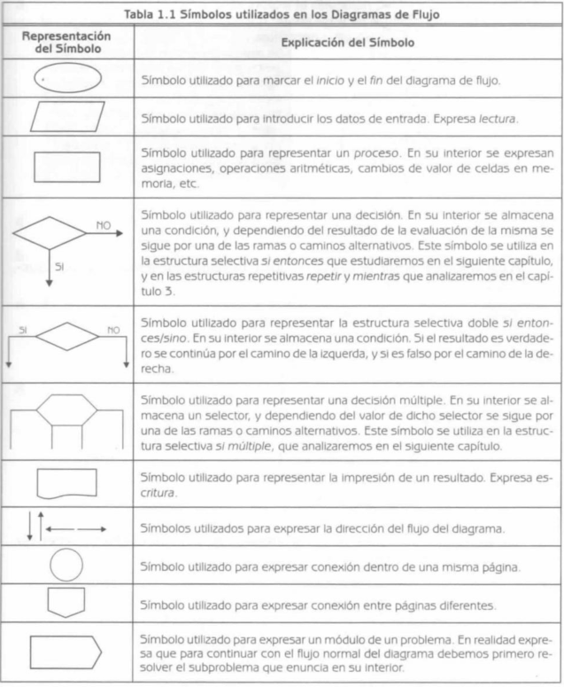

# Conceptos Básicos

- [1. Fundamentos de la Algoritmia](#1. Fundamentos de la Algoritmia)
  - [1.1 ¿Qué es un algoritmo?](#1.1 ¿Qué es un algoritmo?)
  - [1.2 Tipo de Algoritmos](#1.2 Tipo de Algoritmos)
  - [1.3 Como Escribir un Algoritmo](#1.3 Como Escribir un Algoritmo)
  - [1.4 Partes de un algoritmo](#1.4-Partes-de-un-algoritmo)
  - [1.5 Estructuras básicas de un algoritmo](#1.5 Estructuras básicas de un algoritmo)
  
  
- [2. Análsis y Resolución de problemas](#2. Análsis y Resolución de problemas)
  - [2.1 Análisis del problema](#2.1 Análisis del problema)
  - [2.2 Resolución del problema](#2.2 Resolución del problema)
  - [2.3 Fases en la reolución de problemas](#2.3 Fases en la reolución de problemas)
  
  
- [3. Diseño de Algoritmos](#3. Diseño de Algoritmos)
  - [3.1 Diseño del Algoritmo](#3.1 Diseño del Algoritmo)
  - [3.2 Diagrama de Flujo](#3.2 Diagrama de Flujo)

  
  
- [4. Técnicas de diseño de algoritmos](#4. Técnicas de diseño de algoritmos)
  
  - [4.1 Algoritmos Paralelos](#4.1 Algoritmos Paralelos)
  - [4.2 Algoritmo Probabilísticos](#4.2 Algoritmo Probabilísticos)
  - [4.3 Algoritmos Determinísticos](#4.3 Algoritmos Determinísticos)
  - [4.5 Algoritmos No Determinísticos](#4.5 Algoritmos No Determinísticos)
  - [4.6 Programación Dinámica](#4.6 Programación Dinámica)

## 1. Fundamentos de la Algoritmia

### 1.1 ¿Qué es un algoritmo?

*"Un algoritmo es un conjunto de reglas para efectuar algún cálculo".*

Un algoritmo es un conjunto finito de instrucciones, que describen un procedimiento que, llevado a cabo paso a paso, lleva a cabo una tarea específica o resuelve un problema en particular.

### 1.2 Tipo de Algoritmos

Los algoritmos se pueden clasificar en diversos tipos según su naturaleza, como algoritmos cuantitativos, cualitativos, determinísticos, no determinísticos, entre otros.

- **Cualitativos:** Pasos descritos mediante palabras.
- **Cuantitativos:** Pasos que involucran cálculos numéricos.

#### 1.2.1 Características: 

- **Precisión:** Esto significa que cada paso debe ser suficientemente claro, para que una persona puede entenderlo y realizarlo.
- **Determinismo:**  El algoritmo siempre debe arrojar los mismos resultados.
- **Finitud:** Un programa es un algoritmo escrito con un objetivo: conseguir un resultado. Debe tener un principio definido al igual que un final definido.

#### 1.2.2 Excepciones en las características:

Los "Algoritmos probabilistas" son una excepción, ya que pueden realizar elecciones aleatorias dependiendo de la situación. Pero la probabilidad de seleccionar cada valor debe ser conocida y controlada.

### 1.3 Como Escribir un Algoritmo

La escritura de un algoritmo no debe ceñirse a las reglas de un lenguaje de programación específico. Las diferentes formas de escribir un algoritmo incluyen:

- **Descripción textual:** Detalla los pasos en una narrativa clara y estructurada, facilitando la comprensión sin la necesidad de conocer un lenguaje de programación en particular.

- **Lista de operaciones:** Enumera los pasos en un orden secuencial, permitiendo una ejecución lógica del algoritmo.

- **Diagramas de flujo:** Utiliza representaciones gráficas para describir los pasos. Los diagramas de flujo son una herramienta visual que ayuda en la comprensión de la estructura y el flujo del algoritmo.

- **Pseudocódigo:** Emplea palabras clave y una estructura lógica que refleja las estructuras de control del algoritmo, sin ceñirse a las reglas de un lenguaje de programación específico. El pseudocódigo es útil para describir la lógica del algoritmo antes de la implementación en un lenguaje de programación real.

  

### 1.4 Partes de un algoritmo

Las partes principales de un algoritmo son:

- **Entrada:** La entrada representa la operación o acción que permite el ingreso de los datos del problema
- **Proceso:** El proceso representa la operación o el conjunto de operaciones secuenciales cuyo objetivo es obtener la solución del problema.
- **Salida:** La salida representa una operación o conjunto de operaciones que permiten comunicar al exterior el o los resultados alcanzados.

### 1.5 Estructuras básicas de un algoritmo

El ***flujo de ejecución*** es el orden el cual siguen dichas instrucciones durante la ejecución de un programa. Para esto existes tres tipos de estructuras básicas:

- **Secuencia:** constituido por 1 o N instrucciones que se ejecutan según el orden que han sido escritas.
- **Selección, bifurcación o alternativa:** consta de una instruccion especial o de una o 2 secuencias de instrucciones.
- **Iteración, bucle o repetición:** Consta de una instruccion de decicón especial que tiene dos resultados, verdadero o falso y esta se repetirá.

## 2. Análsis y Resolución de problemas

### 2.1 Análisis del problema

El primer paso en la resolución de problemas mediante una computadora es comprender el problema en sí. Es importante definir claramente el problema, identificar los datos de entrada y salida y comprender las restricciones y requerimientos. El análisis del problema debe estar completo antes de proceder a cualquier otra fase.

### 2.2 Resolución del problema

Los siguientes son los pasos esenciales en la resolución de un problema:

- Análisis del problema: Como mencionado anteriormente, se debe entender completamente el problema.
- Diseño o desarrollo de un algoritmo: Crear un plan paso a paso para resolver el problema.
- Transformación del algoritmo en un programa (codificación): Convertir el algoritmo en un lenguaje de programación.
- Ejecución y validación del problema: Probar el programa y asegurarse de que funcione correctamente.

#### Importancia de los Algoritmos

Los algoritmos son la esencia de la resolución de problemas y son independientes del lenguaje de programación y la computadora. Son más importantes que los lenguajes de programación o las computadoras, ya que estos últimos son solo medios para ejecutar el algoritmo.

### 2.3 Fases en la reolución de problemas

- *Análisis del problema*
- *Diseño del algoritmo*
- *Codificación*: Transformar el algoritmo en un lenguaje legible por la computadora.
- *Compilación y Ejecución*: Probar el código.
- *Verificación*: Asegurarse de que el programa funciona según lo previsto.
- *Depuración*: Corregir cualquier error.
- *Mantenimiento*: Realizar ajustes y actualizaciones según sea necesario.
- *Documentación*: Registrar todos los detalles del proceso para futuras referencias.

## 3. Diseño de Algoritmos

### 3.1 Diseño del Algoritmo

Aquí se deben establecer las propiedades matemáticas de los algoritmos, el tiempo de ejecución y las funciones del tamaño del ejemplo a resolver.

### 3.2 Diagrama de Flujo

Un diagrama de flujo representa gráficamente los pasos o procesos para alcanzar la solución de un problema, facilitando su escritura en un lenguaje de programación.

#### 3.2.1 Reglas de Construcción de un Diagrama de Flujo

- Debe tener un inicio y un fin.
- Utilizar líneas rectas, verticales y horizontales.
- Todas las líneas deben estar conectadas.
- Construir de arriba hacia abajo.
- Utilizar notación independiente del lenguaje de programación.
- Agregar comentarios cuando sea complejo.
- Utilizar conectores si se requiere más de una hoja.

Los diagramas de flujo tendrán figuras y cada una de ellas representarán una acción. Estas figuras y representaciones dependerán del estándar usado. Las figuras presentadas satifacen las recomendaciones ISO y ANSI.

Este sería el ejemplo de un algoritmo realizado con un diagrama de flujo:

Los símbolos colocados, en un diagrama de flujo, deben de estar correctamente ordenados esto facilitará posteriormente su escritura en un lenguaje de programación

## 4. Técnicas de diseño de algoritmos

### 4.1 Algoritmos Paralelos

Permite tratar rápidamente grandes tareas mediante la paralelización, ejecutando partes en simultáneo y luego uniéndolas.

### 4.2 Algoritmo Probabilísticos

Estos algoritmos toman decisiones al azar para obtener una solución aproximada.

### 4.3 Algoritmos Determinísticos

Producen la misma salida para una entrada dada, siendo completamente predictivos.

### 4.5 Algoritmos No Determinísticos

Con la misma entrada, ofrecen muchos posibles resultados, no proporcionando una solución única.

### 4.6 Programación Dinámica

Método para reducir el tiempo de ejecución de un algoritmo utilizando sub-problemas superpuestos y subestructuras óptimas.

[Back to top](#Conceptos Básicos)