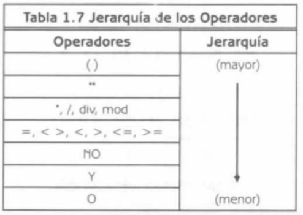
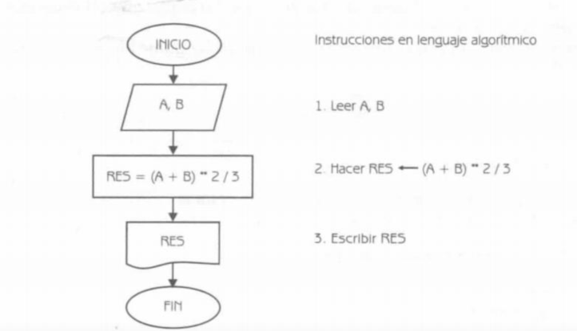

# Conceptos Fundamentales


- [Tipo de datos](#Tipo de datos)
- [Identificadores, constantes y variables](#Identificadores, constantes y variables)
- [Operaciones y Expresiones](#Operaciones y Expresiones)
  - [Operadores Aritméticos](#Operadores Aritméticos)
  - [Expresiones lógicas](#Expresiones lógicas)
    - [Operadores relacionales](#Operadores relacionales)
    - [Operadores Lógicos](#Operadores Lógicos)

  - [Jerarquía de todos los operadores](#Jerarquía de todos los operadores)
  - [Bloques de asignación](#Bloques de asignación)

- [Programas](#Programas)


## Tipo de datos


### Simples

La principal caracteristica de estos datos es que solo ocupan una casilla en la memoria, por lo tanto, una variable simple hace referencia a un uníco valor a la vez. Dentro de este grupo se encuentran: 

- Enteros (Números sin decimales)
- Reales (Números enteros y con decimales)
- Caracteres (Un solo caracter).
- Booleanos.
- Enumerados.
- Subrangos.


#### Datos numéricos

Dentro de estos se encuentran los enteros y los reales. Los números enteros son aquellos que no tienen decimal y pueden estar precedidos por un signo positivo o negativo.

Los npumeros reales son aquellos que tienen partedecimal  y pueden estar precedidos por un signo positivo y negativo.


Ejemplo:

- Enteros: .... -4, -3, -2 -1 0 1, 2, 3, 4.....
- Reales: .... -4, -3.001, -2.3 -1 0 1, 2, 3, 4.5 .....


#### Datos alfanuméricos

Estsos pueden ser caracteres simples, es decir, un solo carácter. Si este tieme más de un solo carácter es una cadena de datos y este se transformaría en un dato de tipo estructurado.

Los datos alfa númericos pueden contener carácteres de letras, dígitos y símbolos especiales.

Para poder definir estos datos se deben de poner entre los símbolos de comillas simples o dobles.


Ejemplo:

- Caracteres: 'g', "#", '1'
- Cadena de caracteres:  "Hola", 'Carlos Gomez', "725-234-5246"


#### Datos Lógicos

Dentro de estos se encuentran los booleanos. Son tipos de datos que sólo pueden tomar dos valores: Verdadero o Falso.


### Estructurados

Este hace referencia a que con un nombre (identificador de variable estructurada) se hace referencia a un grupo de casillas en la memoria. Es decir, un dato estructurado tiene varios componentes. Dentro de estos se encuentran:

- Arreglos.
- Cadenas de caracteres (Más de un solo caracter).
- Registros.
- Conjuntos.


## Identificadores, constantes y variables


Todos los datos para poder ser utlizados deben de almacenarse en casillas o celdas de memoriap ara su posetrior utilización. Estas casillas o celdas de memoria se les llaman variables o constantes. Estas variables o constantes tienen un nombre que permite su identificación.

Entonces una variable o constante es una casilla que permite almacenar un tipo de dato. Estas variables a su vez tienen un nombre que es su identificador.

Estos identificadores tienen ciertas reglas, claro que esto variará de lenguaje de programación a lenguaje de programación.

- El primer caracter que forma un identificador de ser una letra.
- Los demás caracteres pueden ser letras, digitos o el símbolo  ( _ ).
- La longitud del identificador es igual a 7 en la mayoria de lenguajes de programación. 


### Constantes

Son celdas o casillas de memoria cuyo dato guardado no cambia durante la ejecución del programa.


### Variables

Son celdas o casillas que pueden o no cambiar durante la ejecución del programa.


## Operaciones y Expresiones


En los algoritmos se pueden realizar operaciones aritméticas, estas se hacen con el uso de los operadores aritméticos.

 

### Operadores Aritméticos

| Operadores | Descripción     |
| ---------- | --------------- |
| +          | Sumar           |
| -          | Restar          |
| /, div     | Dividir         |
| *          | Multiplicar     |
| %, mod     | Residuo o Resto |
| **         | Exponente       |


Así como en matemáticas estos operadores tienen una jerarquía:

| Operador  | Jerarquía | Operación                          |
| --------- | --------- | ---------------------------------- |
| **        | (mayor)   | Potencia.                          |
| *, /, mod |           | Multiplicación, división, residuo. |
| +, -      | (menor)   | Suma, resta.                       |


#### Reglas para resolver una expresión aritmética:

- Si una expresión contiene subexpresiones entre paréntesis, éstas se evalúan primero, respetando la jerarquía. Si estas subexpresiones se encuentran anidadas, primero se resuelven las que se encuentran en el último nivel del anidamiento.
- Los operadores aritméticos se aplican teniendo en cuenta la jerarquía de izquierda a derecha.


### Expresiones lógicas

Estas están conformadas por expresiones lógicas o booleanas. Están constituidas por números, variables y operadores lógicos o relacionales. El valor que pueden tomar estas expresiones es el de verdadero o falso. Y se utilizan para estructuras selectivas (dependiendo del resultado de la evaluación se toma por un determinado camino alternativo).


#### Operadores relacionales

Los operadores relacionales son operadores que permiten comparar dos operandos. Los operandos pueden ser números, alfanuméricos, constantes o variables. Las constantes o variables, a su vez, pueden ser de tipo entero, real, caracter o cadena de carácteres. Su resulstado es verdadero o falso.


| Operadores | Descripción       |
| ---------- | ----------------- |
| >          | Mayor que         |
| <          | Menor que         |
| >=         | Mayor o igual que |
| <=         | Menor o igual que |
| ==         | Igual             |


#### Operadores Lógicos

Los operadores lógicos son operadores que permiten formular condiciones complejas a partir de condiciones simples. Los operadores lógicos son de conjunción (y), disminución (o) y negación (no). 

| Operadores | Jerarquía | Descripción |
| ---------- | --------- | ----------- |
| not        | (Mayor)   | No          |
| and        |           | Y           |
| or         | (menor\|) | O           |


### Jerarquía de todos los operadores




### Bloques de asignación

Un bloque de asignación se utiliza para asignar valores o expresiones a una variable. La asignación es una operación destructiva. Esto significa qeu si la variable tenía asignado un valor, éste se destruye, conservando ahora el nuevo valor. El formato de la asiganción es el siguiente:


Variable <--- expresión o valor


Donde: Expresión puede ser aritmética o lógica, o una constante o variable.


## Programas

Un programa es un conjunto de instrucciones que sigue la computadora para alcanzar un resultado específico. El programa se escribe en un lenguaje de programación a partir de un diagrama de flujo diseñado con anterioridad.

Cuando tenemos un problema de tipo algorítmico, primero desarollamos el algoritmo, que proporciona una solución general. Posteriormente construimos el diagrama de flujo, que esquematiza gráfica y detalladamente la solución del problema, y a partir de éste, escribimos el programa en algún lenguaje de programación.


### Ejemplo

Tenemos que hacer una operación la cual sume dos variables y los eleve a dos tercios. Para esto graficaríamos nuestro diagrama de flujo:




Y posteriormente pasaríamos el diagrama a un código:

```js
var A = 1
var B = 2
var RES = (A+B)**2/3
console.log(RES)
// resultado = 3
```


[Back to top](#Conceptos Fundamentales)

