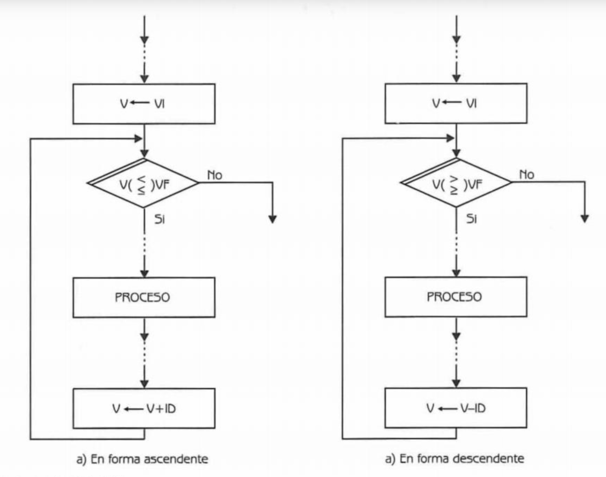

# Estructuras algorítmicas (Control de flujo)


- [Estructuras Algorítmicas Selectivas o Condicionales](#Estructuras Algorítmicas Selectivas o Condicionales)
  - [if  (Si entonces)](#if  (Si entonces))
  - [if / else (Si entonces / sino)](#if / else (Si entonces / sino))
  - [si múltiple](#si múltiple)
  - [anidadas](#anidadas)

- [Estructuras Algorítmicas Repetitivas o Bucles](#Estructuras Algorítmicas Repetitivas o Bucles)
  - [for (repetir)](#for (repetir))
  - [while (mientras)](#while (mientras))


## Estructuras Algorítmicas Selectivas o Condicionales


Las estructuras  lógicas selectivas se utilizan cuando el desarrollo de la solución de un problema necesita tomar una decisión, para establecer un proceso o señalar un camino alternativo a seguir.

Esta toma de decisión se basa en la evaluación de una o más condiciones que nos señalarán como alternativa o consecuencia, la rama a seguir. Hay ocasiones en la que esta toma de decisiones se vuelve realiza en cascada, es decir, se toma una decisión y posteriormente se vuelve a tomar otra decisión. 


### if  (Si entonces)

Esta estructura selectiva permite que el flujo del diagrama siga por un camino específico si cumple una condición o conjunto de condiciones. Si al evaluar la condición (o condiciones) el resultado es verdadero, entonces se ejecutará cierta operación. Posteriormente se continúa con la secuencia normal del diagrama.


### if / else (Si entonces / sino)

La estructura selectiva "si entonces / sino" permite que el flujo del diagrama se bifurque por dos ramas diferentes en el punto de la toma de decisión. Si al evaluar la condición el resultado es verdadero, entonces sigue por un camino específico. Por otra parte, si el resultado es falso entonces se sigue por otro camino.


### si múltiple

La estructura selectiva si múltiple permite que el flujo del diagrama bifurque por varias ramas en el punto de la toma de decisiones.


### anidadas

La estructura selectiva en cascada es simplemente un condicional al cual le sigue otro condicional, es decir, cuando se desarrolla una solución de un problema en el que luego de tomar una decisión y marcar un camino, es necesario tomar otra decisión.


## Estructuras Algorítmicas Repetitivas o Bucles


Es muy común encontrar algoritmos que se tengan que ejecutar repetidamente, a esto se le denomina un ciclo. Todo ciclo debe de terminar de ejecutarse luego de un número finito de veces, por lo que es necesario en cada iteración del mismo, evaluar las condiciones necesarias para decidir si se debe seguir ejecutando o si debe detenerse.


### for (repetir)

La estructura repetitiva "for", es la estructura algorítmica adecuada para utilizar en un ciclo que se ejecutará un número definido de veces. Esta estructura está presente en todos los lenguajes de programación.

Entonces en esta estructura el número de repeticiones se obtiene del planteamiento del problema. Por ejemplo, si necesitamos obtener el promedio de un alumno, debemos sumar N calificaciones y dividir la suma total entre N. Las veces que se va a repetir será el número de calificaciones que se tenga que sumar.





Donde:

- V es la variable de control del ciclo
- VI es el valor inicial
- VF es el valor final
- ID es el incremento o decremento, según sea la estructura ascendente o descendente.


V (contador del ciclo, generalmente representado por las letras i, j, k, v) toma un valor inicial y se compara con el valor final. El ciclo se ejecutará mientras V es menor, menor igual, mayor o mayor igual al valor de VF. El valor de V se incrementa o decrementa en cada iteración. Cuando V supera el valor de VF. entonces el ciclo se detiene.


```
for (let i = 0; i < 10; i++) {
  console.log(i);
}
```


### while (mientras)

Esta estructura se utiliza cuando no sabemos cuantas veces se tendrá que repetir el ciclo. Dicho número depende de las proposiciones dentro del ciclo.

Ejemplo, supongamos que tenemos que calificar a N número de alumnos, pero no sabemos exactamente cuantos alumnos son, por lo que el ciclo se repetirá mientras tengamos calificaciones de alumnos.

- Ciclo: Conjunto de instrucciones que se ejecutarán rapidamente.
- Condición de terminación: La evaluación de esta condición permite decidir cuándo finalizará la ejecución del ciclo. La condición se evalúa al inicio del mismo.


Donde:

- PI: La preposición inicial, debe tener un valor verdadero inicialmente si el valor de PI es falso, entonces el ciclo no se ejecuta.


```
while (i < 10) {
  text += "The number is " + i;
  i++;
}
```


[Back to top](#Estructuras algorítmicas)