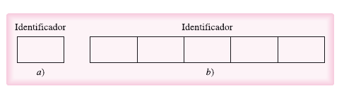
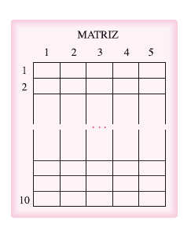
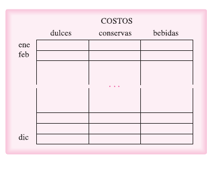
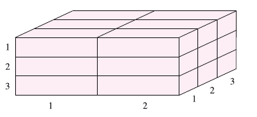
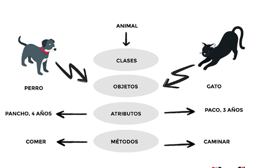
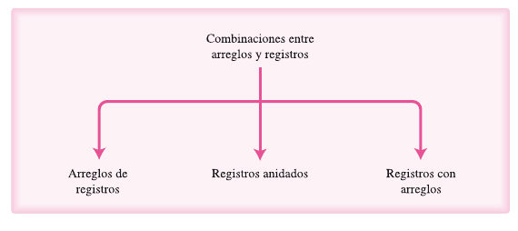
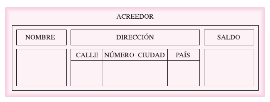
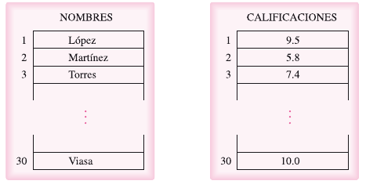
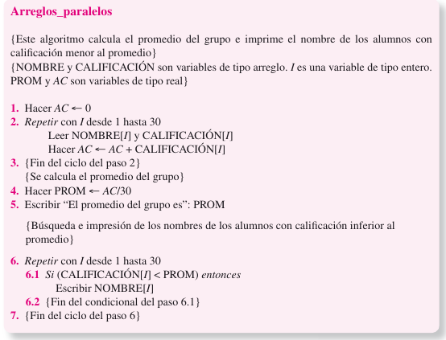

# Estructuras de Datos


- [Estructuras de datos: Arreglos](#Estructuras de datos: Arreglos)
  - [Arreglos unidimensionales ](#Arreglos unidimensionales )
    - [Operaciones con arreglos](#Operaciones con arreglos)
  - [Arreglos multidimensionales](#Arreglos multidimensionales)
    - [Arreglos bidimensionales ](#Arreglos bidimensionales )
    - [Arreglos de más de dos dimensiones](#Arreglos de más de dos dimensiones)
  - [Clase Arreglo](#Clase-Arreglo)
    - [Programación Orientada a Objetos](#Programación-Orientada-a-Objetos)
    - [¿Qué Es Una Clase Arreglo?](#¿Qué Es Una Clase Arreglo?)
- [Estructura de datos: Registros](#Estructura de datos: Registros)
  - [Acceso a los campos de un registro](#Acceso a los campos de un registro)
  - [Combinación entre arreglos y registros ](#Combinación entre arreglos y registros )
  - [Arreglos Paralelos](#Arreglos Paralelos)
  - [Registros y Clases](#Registros y Clases)


En este capítulo se presentan las estructuras fundamentales de datos. Se estudian los arreglos unidimensionales, bidimensionales y multidimensionales. Además, se explican los registros. Por último, se incluye una breve introducción a la programación orientada a objetos con el fin de que sirva como base para entender las principales estructuras de datos desde este enfoque. Tambíen se desribe la clase arreglo.


## Introducción

Para que la información sea procesada, se requiere que ésta sea almacenada en la memoria de la computadora. De acuerdo con la forma en que los datos se organizan, se clasifican en:

- Tipo de datos simples.
- Tipo de datos estructurados.


### Los datos simples

Ocupan un solo dato en una casilla de la memoria. Por tanto, una variable simple hace referencia a un único valor a la vez. En este grupo de datos se encuentran: Números enteros y reales, caracteres, booleanos, enumerados y subrangos. Los últimos no existen en algunos lenguajes de programación.


### Los datos estructurados

Los datos estructurados se caracterízan por el hecho que un nombre (identificador) hace referencia a un gupo de casillas de memoria.




## Estructuras de datos: Arreglos


Un arreglo (matriz) es una colección ordenada de datos (tanto [primitivos](https://developer.mozilla.org/es/docs/Glossary/Primitive) u [objetos](https://developer.mozilla.org/es/docs/Glossary/Object) dependiendo del lenguaje). Los arreglos (matrices) se emplean para almacenar multiples valores en una sola variable, frente a las variables que sólo pueden almacenar un valor (por cada variable).


### Arreglos unidimensionales 

Un arreglo unidimensional se puede definir como:

*"Colección finita, homogénea y ordenada de elementos"*

- Finita: Todo arreglo tiene un límite, es decir, debe determinar cuál será el número máximo de elementos que podrán formar parte del arreglo.
- Homogénea: Todos los elementos de un arreglo son del mismo tipo (todos enteros, reales, strings, etc., pero nunca una combinación de distintos tipos).
- Ordenada: Se puede determinar cuál es el primer elemento, el segundo, el tercero,... y el n-ésimo elemento.


Entonces un arreglo tiene la característica de que puede almacenar a N elementos del mismo tipo y además permite el acceso a cada uno de estos elementos. Así, se distinguen dos partes de arreglos.

- Los componentes: Hacen referencia a los elementos que componen o forman el arreglo, es decir, los valores que se almacenan.
- Los índices: son los que permiten accesar a los componentes del arreglo en forma individual. Para hacer referencia a un componente necesitamos dos cosas:
  - El nombre del arreglo.
  - El índice del elemento.


Ejemplo:

```js
const nombreDelArreglo = [valor1, valor2, valor3, valor4]
```


#### Operaciones con arreglos

A continuación se presentan las opreaciones más comunes en arreglos:

- Lectura/Escritura
- Asignación
- Actualización:
  - Inserción
  - Eliminación
  - Modificación
- Ordenación
- Búsqueda


### Arreglos multidimensionales

Hasta ahora hemos visto los arreglos unidimensionales que se pueden ver como una única fila de una tabla, por ejemplo:

| valor1 | valor2 | valo3 | valor4 | valor5 |
| ------ | ------ | ----- | ------ | ------ |


Sin embargo, el número de dimensiones (índices) puede cambiar dependiendo del problema a resolver y a las características del lenguaje a utilizar.


#### Arreglos bidimensionales 

Los arreglos bidimensionales se pueden ver como una tabla:

| Meses/Lluvias | México | Querétaro | Puebla | Morelos |
| ------------- | ------ | --------- | ------ | ------- |
| Enero         | 45     | 60        | 58     | 50      |
| Febrero       | 3      | 15        | 22     | 7       |


Al igual que los arreglos unidimensionales, estos arreglos deben ser homogéneos, finitos y ordenados, donde se hace referencia a cada elemento por medio de dos índices. El primero de los índices se utiliza para indicar el renglón y el segundo para indicar la columna.

Entonces en el arreglo A(M x N), para acceder a un elemento diríamos: A[ I, J]. El elemento a pedir estará en el renglón I y en la columna J.

Donde:

- M son renglones
- N son columnas


En el ejemplo anterior podríamos llamar al arreglo "mesesDeLluvia", para acceder a los meses de lluvia de la Ciudad de México, podríamos decir que la columna de la Ciudad de México se llamase "M" y la fila será por la inicial del mes. Entonces si quisiera acceder a la cantidad de lluvia en enero sería:


```js
mesesDeLLuvia[M, E] 
// = 45
```


##### Declaración de arreglos bidimensionales

Los arreglos bidimensionales se declaran cuando se especifican el número de columnas, junto con el tipo de datos de los componentes.


```
id_arreglo = ARREGLO[líminfr...límsupr, líminfc...límsupc] DE tipo
```


Con líminfr y límsupr se declara el tipo de dato del índice de los renglones y cuántos renglones tendrá el arreglo. Así mismo líminfc y límsupc se declara el tipo de dato del índice de las columnas y cuántas columnas tendrá el arreglo.

Con **tipo** se declara el tipo de datos de todos los componentes del arreglo.

El númeto total de componentes (NTC) de un arreglo bidimensional está determinado por la expresión:

```
NTC = (límsupr - líminfr + 1) * (límsupc - líminfc + 1)
```


Al igual que el arreglo unidimensional, los índices pueden ser de cualquier tipo de dato ordinal (escalar, entero, cadenas de carácteres, etc). Mientras sus componentes pueden ser de cualquier tipo (reales, enteros, cadenas de caracteres , etc).


**Ejemplo:**

Arreglo bidimensional de números reales con índices enteros.

```
MATRIZ = ARREGLO[1..10,1..5] DE reales
```





Arreglo bidimensional de números reales con índices de tipo escalar:

```
meses = (ene,feb,mar,abr,may,jun,jul,ago,set,oct,nov,dic)
departamentos = (dulces,conservas,bebidas)

COSTOS = ARREGLO[meses,departamentos] DE reales
```





##### Operaciones con arreglos bidimensionales

Las operaciones de los arreglso bidimensionales son:

- Lectura/Escitura
- Asignación
- Actualización
  - Inserción
  - Eliminación
  - Modificación
- Ordenación
- Búsqueda


#### Arreglos de más de dos dimensiones

Un arreglo de N dimensiones se define como una collecón homogénea y ordenada de K1 * K2 * .... * Kn elementos. Para hacer referencia a cada componente de un arreglo de N dimensiones, se usarán N índices, uno para cada una de sus dimensiones.

El arreglo A de N dimensiones se davlara de la siguiente manera:

```
A = ARREGLO [LI1..LS1, LI2..LS2,...., LIN..LSN]
```


El NTC será:

```
NTC = (LS1 - LI1 + 1)*(LS2 - LI1 +1)*...*(LSN - LIN + 1)
```


Un ejemplo de como podríamos visualizar a un arreglo tridimencional:


```
TRIDIMENCIONAL = ARREGLO[1..3, 1..2, 1..3] DE real
```





### Clase Arreglo

Para entender este punto primero debemos entender que es la programación orientada a objetos.


#### Programación Orientada a Objetos

La Programación Orientada a Objetos (POO) es un paradigma de programación, es decir, un modelo o un estilo de programación que nos da unas guías sobre cómo trabajar con él. Se basa en el concepto de clases y objetos. Este tipo de programación se utiliza para estructurar un programa de software en piezas simples y reutilizables de planos de código (clases) para crear instancias individuales de objetos. 

¿Cómo se crean los programas orientados a objetos? Resumiendo mucho, consistiría en hacer clases y crear objetos a partir de estas clases. Las clases forman el modelo a partir del que se estructuran los datos y los comportamientos.

El primer y más importante concepto de la POO es la **distinción entre clase y objeto**.

Una **clase** es una plantilla. Define de manera genérica cómo van a ser los objetos de un determinado tipo. Por ejemplo, una clase para representar a animales puede llamarse ‘animal’ y tener una serie de **atributos**, como ‘nombre’ o ‘edad’ (que normalmente son propiedades), y una serie con los comportamientos que estos pueden tener, como caminar o comer, y que a su vez se implementan como métodos de la clase (funciones).





Entonces una clase es el molde donde saldrán los objetos, esta clase definirá los atributos del objeto y sus acciones denominados "métodos". A partir de esta clase se podrán crear varios objetos sin necesidad de tener que re-escribir el código completo.

La programación orientada a objetos tiene cuatro propiedades:

- Abstracción: Permite concentrarse en lso datos y operaciones que definan un conjunto de objetos, ignorando los elementos que no son relevantes.
- Encapsulamiento: Implica que tanto los atributos como los métodos forman un todo y pueden ocultarse de los clientes de la clase, al controlar de esta anera el acceso que se tenga a sus integrantes.
- Herencia: Representa la propiedad que permite compartir atributos y metodos entre clases.
- Polimorfismo: Ofrece la facilidad de que ciertos métodos puedan adoptar distintas formas


#### ¿Qué Es Una Clase Arreglo?

Una clase arreglo tendrá atributos y métodos. Los atributos constituirán la colección de elementos y el tamaño. Los métodos serán todas las operaciones analizadas previamente (lectura, inserción, elminación, etc).


```python
class Arreglo:
	Datos = ARREGLO [LI..LS]
	
	def Lectura(self):
	print(Datos)
	
```


En este ejemplo nuestra clase es "Arreglo". Sus atributos es el tamaño del arreglo y sus elementos. Por último su métdo es las operaciones que puede hacer el arreglo, en este caso, la lectura del mismo.


*"Nota: Se llama instancia a **todo objeto que derive de algún otro**. De esta forma, todos los objetos son instancias de algún otro, menos la clase Object que es la madre de todas".*


## Estructura de datos: Registros

Los arreglos son colecciones de datos de  un mismo tipo. Sin embargo habrá ocaciones donde necesitemos una colección de datos con diferentes tipos de datos. Por ejemplo, los datos de un usuario donde se necesite:

- Nombre: cadena de carácteres.
- Número: enteros.
- Correo: cadena de carácteres.


Por lo que a la estructura que permite almacenar diferentes tipos de datos se le conoce como un **registro**.


Ejemplo:

```
id_registro = Registro
    id_campo1: entero
    id_campo2: string
```


### Acceso a los campos de un registro

Para acceder a un campo o elemento se necesita:

- La variable de tipo registo: variable_registro.
- El identificador del campo deseado: id_campo.

syntax:

variable_registro.id_campo


Ejemplo:

```
direccion = registro
	calle: AV. Universidad
	numero: 105
	ciudad: Queretaro
	
direccion.calle
// La respuesta a esto sería "AV. Universidad"
```


### Combinación entre arreglos y registros 

Anteriormente mencionamos que un campo de un registro puede ser cualquier tipo de datos, por lo que un registro puede almacenar otro registo o un arreglo. A su vez cada componente de un arreglo puede ser un arreglo o un registro.





**Ejemplo:**

```
ACREEDOR = REGISTRO
	nombre: cadena_de_caracteres
	dirección: DOMICILIO
	saldo: real
{fin de la declaración del registro ACREEDOR}
```





Para acceder a sus elementos solo se tendría que especificar a cual se requiere acceder:

- ACREEDOR.nombre
- ACREEDOR.dirección.calle


### Arreglos Paralelos

Son dos o más arreglos cuyos elementos se corresponden. Es decir, los componentes que ocupan una misma posición en diferentes arreglos tienen una estrecha relación semántica.

Supongamos que se conoce el nombre del alumno y la calificación obtenida de un examen aplicado a un grupo de 30 almnos. Si se quisiera usar estos datos para generar más información como el promedio del grupo o la calificación más alta se podrían usar arreglos paralelos.

En este caso se utilizarían dos arreglos unidimencionales donde en uno se almacenen los nombres y el otro las calificaciones. Cada elemento del arreglo "NOMBRES" correspondrá a un elemento del arreglo "CALIFCACIONES". Así cada que se haga una referencia a una calificación de "NOMBRES" se utilizará "CALIFICACIÓN".




A continuación se presenta un algoritmo con la solución al problema anterior:





### Registros y Clases

Los registros son la estructura de datos que más se parecen a una clase. Tiene un nombre identificador y los datos que almacenan se pueden comparar con atributos de una clase. Por lo que solo se le tendría que agregar un método para que este se convierta en una clase.

Por lo que si queremos ver a un registro como una clase solo se tendría que definir  su nombre, sus atributos (los campos del registro), y sus métodos (todas las operaciones válidas que realizará la clase como leer, actualizar, eliminar, etc).


[Back to top](#Estructuras de Datos)