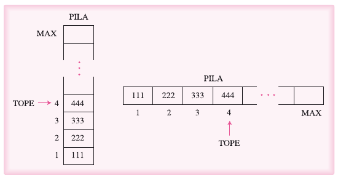
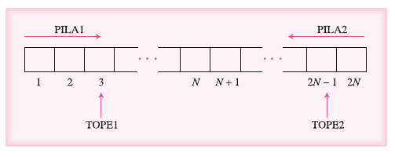
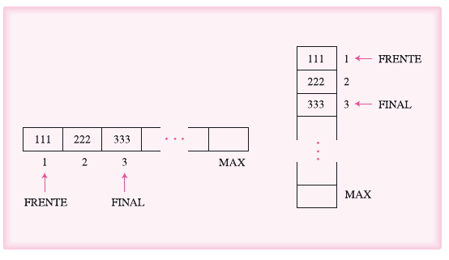

# Pilas y colas

- [Introducción](#Introducción)
- [Pilas](#Pilas)
  - [Definir una pila](#Definir una pila)
- [Colas](#Colas)
  - [Colas circulares](#Colas circulares)
  - [Doble Cola](#Doble Cola)

## Introducción

En este capitulo se dedica al estudio de las pilas y colas, que son estructuras de datos lineales con restricciones en cuanto a la posición en la cual se pueden llevar acabo las operaciones de inserción y eliminación de componentes.

## Pilas

Una pila representa una estructura lineal de datos en la que se puede agregar o quitar elementos únicamente por uno de los dos extremos. En consecuencia, los elementos se eliminan en orden inverso al que se insertaron; es decir, el último elemento que se mete en la pila es el primero que se saca. Debido a esto se le conoce como LIFO (last-input, first-output).

Una pila se le define formalmente como una colección de datos a los cuales se puede acceder mediante un extremo, que se conoce generalmente como tope. 

Las pilas son estructuras lineales, como los arreglos, ya que los componentes ocupan lugares sucesivos en la estructura y cada uno de ellos tiene un único predecesor, con exepción del último y del primero, respetivamente.

Las pilas no son estrcutruas fundamentales de datos; es decir, no están definidas com otales en los lenguajes de programación. Para su representación requieren el uso de otras estructuras de datos, como:

- Arreglos
- Listas

### Definir una pila

Para esto se utilizará un arreglo. En consecuencia, es importante definir el tamaño máximo de la pila, así como una variable auxiliar que se denomina TOPE. Esta variable se utiliza para indicar el ultimo elemento que se insertó en la pila.

Al utilizar arreglos para una pila, se debe de reservar un espacio en la memoria con anticipación. Es decir, se le dice a la memoria cual es su capacidad máxima y posterior a eso no se puede incertar un número mayor de elementos a su capacidad máxima.

Si la pila se llena y se intentara insertar un nuevo elemento se produce un error conocido como desbordamiento (overflow). Cuando se utiliza un array y se define el tamaño máximo este no se puede expandir ni contraer, esto puede provocar dos inconvenientes, el primero es que el número de elemetos sea mayor a la pila y el segundo es que si se usa una pila muy grande y no se llena se está desperdiciando espacio en la memoria, por lo que para esto existe una solución la cual es  utilizar **espacios compartidos** de memoria.

Entonces supongamos que necesitamos dos pilas, cada una de ellas con un tamaño máximo de N elementos. Se definirá entonces un solo arreglo unidimensional de 2 * N elementos, en lugar de dos arreglos de N elementos cada uno.

PILA 1 se ocupara desde la posición 1 en adelante (1,2,3...) y la PILA 2 se ocupara desde la posición 2*N hacia atrás (2* * N - 1).

### Operaciones con pilas

Las operaciones que se pueden llevar acabo con las pilas son:

- Insertar un elemento — Push —
- Eliminar un elemento — Pop —
- Pila llena: Revisar si la pila está llena.
- Pila vacía: Revisar si la pila se encuentra vacía.

## Colas

Una cola constituye una estructura linea de datos en la que los nuevos elementos se introducen por un extremo y los ya existentes se eliminan por el otro. Los componentes se eliminarán en el mismo orden que se insertaron, es decir, el prmer elemento que se introduce a la estructura es el que será eliminado primero.

Al igual que las pilas no son una estructura de datos fundamentales por lo cual están representados por arreglos y listas.

Para definir una cola con un arreglo se tiene que definir el tamaño máximo de la cola y dos variables auxiliares. La primera de lleas guardará la posición del primer elemento denominado —FRENTE—. Y la segunda variable guardará la última posición del elemento de la cola, denominado —FINAL—.

Las operacione que se pueden realizar con las colas son:

- Insertar un elemento.
- Eliminar un elemento.
- Determinar si está vacío.
- Determinar si está lleno.

### Colas circulares

Las colas circulares constituyen una estructura de datos lineales en la cual el siguiente elemento del último en realidad es el primero. De esta forma se utiliza de manera más eficiente la memoria de una computadora.

### Doble Cola

Una doble cola o bicola es una generalización de una estructura de datos tipo cola. En una doble cola, los lelementos se pueden instertar o eliminar por cualquiera de los dos extremos. Es decir, se puede insertar y eliminar valores tanto por el FRENTE como por la parte FINAL de la cola.

Existen dos variantes de las dobles colas:

- Doble cola con entrada restringida.
- Doble cola con salida restringida.

La primera de ellas ermite que las elminicaciones se realicen por cualquiera de los dos extremos, mientras las inserciones solo por el FINAL de la cola.

La segunda variante permite que las inserciones se realicen por cualquiera de los dos extremos, mientras que las eliminaciones sólo por el FRENTE de la cola.

[Back to top](#Pilas y colas)