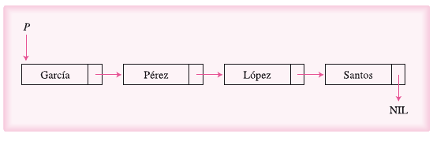
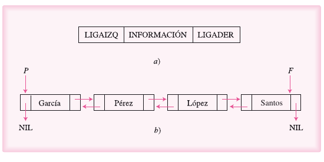
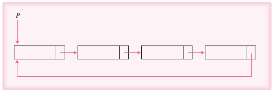

# Listas

- [Introducción](#Introducción)
- [Listas Simplemente Ligadas](#Listas Simplemente Ligadas)
- [Listas Doblemente Ligadas](#Listas doblemente ligadas)
- [Listas circulares](#Listas circulares)
- 
- 

## Introducción

Los arreglos y las listas se denominan estáticas. Reciben este nombre debido a que durante la compilación se les asigna un espacio en la memoria y éste permanece inalterable durante la ejecución de programa.

Las lsistas es un tipo de estructura lineal y dinámica de datos. Lineal porque cada elemento le puede seguir sólo otro elemento; dinámica porque se pede manejar en la memoria de manera flexible, sin necesidad de reservar un espacio con antelación.

La principal ventaja de este tipo de dato es que se puede adquirir posiciones de la memoria a manera que se necesite, y estas se liberan cuando ya no se necesiten. Así es posible crear una estructura dinámica que se expanda o contraiga, según se le agregue o elimine elementos.

Entre las listas se distinguen tres tipos:

- Listas simplemente ligadas
- Listas doblemente ligadas
- Listas circulares.

## Listas Simplemente Ligadas

Una lista simplemente ligada constituye una colleción de elementos llamados nodos. El orden entre éstos se establece por medio de punteros; es decir, direcciones o referencias a otros nodos.

El nodo consta de dos partes:

- Un campo INFORMACIÓN que será del tipo de dato que se quiera almacenar en la lista.
- Un campo LIGA, de tipo puntero, que se utiliza para establecer la liga o el enlace con otro nodo de la lista. Si el nodo fuera el último de la lista, este campo tendrá como valor NIL —Vacío—. Al emplearse el campo liga para relacionar los nodos, no será necesario almacenar físicamente a los nodos en espacios contiguos.

### Operaciones

Las operaciones que pueden efectuarse en una lista simplemente ligada son:

- Recorrido de la lista.
- Inserción de un elemento.
- Borrado de un elemento.
- Búsqueda de un elemento.

## Listas doblemente ligadas

Una lista dolemente ligada es una colección de nodos, en la cual cada uno de ellos tiene dos apuntadores, uno apuntando a su predecesor (LIGAIZQ) y otro a su sucesor (LIGADER). Por medio de estos punteros se podrá entonces avanzar o retroceder a través de la lista, según se tomen las irecciones de uno u otro apuntador. 

## Listas circulares

Las listas circulares son similares a las listas simplemente ligadas. Sin embargo, tienen la característica de que el último elemento de la lista apunta al primero, en lugar de apuntar al vacío o NIL.

Se define una lista simplemente ligada circular como una colleción de elementos llamados nodos, en el cual el último nodo apunta al primero.

[Back to top](#Listas)