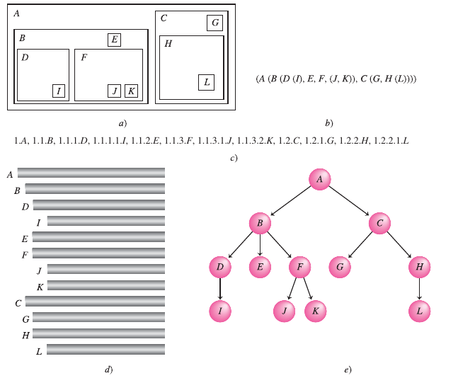

# Árboles

## Introducción

Hasta ahora solo hemos estudiado las estructuras lineales, tanto estáticas como dinámicas, donde cada elemento siempre le sucede o le precede como máximo a otro elemento. 

En la estructura de árboles se introduce el concepto de ramificación entre componentes o nodos.

Los árboles son estructuras de datos no lineales y dinámicos de datos. Dinámicas puesto a que las mismas pueden cambiar tanto de forma como de tamaño durante la ejecución del programa. No lineales, puesto a que cada elemento del árbol puede tener mas de un sucesor.

| Estructuras Estáticas | Estructuras dinámicas |
| --------------------- | --------------------- |
| Arreglos              | Listas                |
| Registros             | Árboles               |
|                       | Gráficas              |

| Estructuras Lineales | Estructuras no Lineales |
| -------------------- | ----------------------- |
| Arreglos             | Árboles                 |
| Registros            | Gráficas                |
| Pilas                |                         |
| Colas                |                         |
| Listas               |                         |

## Árboles en General

Un árbol se puede definir como una estructura jerárquica aplicada sobre una colección de elementos u objetos llamados nodos, uno de los cuales es conocido como raíz. Además se crea una relación o parentesco entre los nodos dando lugar a términos como padre, hijo, hermano, antecesor, sucesor ancestro, etc.

Los árboles son estructuras recursivas, ya que cada subárbol es a su vez un árbol. 

