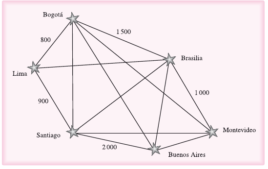

# Gráficas

Anteriormente vimos los árboles en el cual un nodo o elemento puede tener como máximo un nodo que le precede o raíz. Por su parte las gráficas son estructuras no lineales las cuales cada una de sus nodos pueden tener uno o más predecesores y sucesores.

En una gráfica se distinguen dos elementos: los nodos, mejor conocidos como vértices, y los arcos, llamados aristas, que conectan un vértice con otro. Los vértices almacenan información y las aristas representan la relación entre dicha información.

