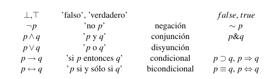
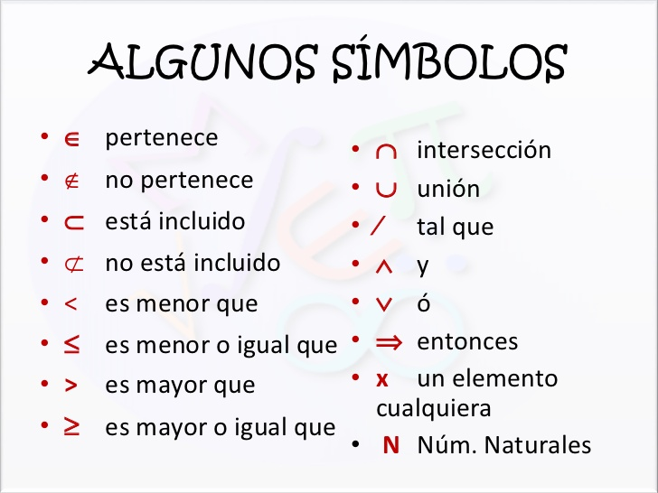

# Lógica de proposiciones

- [Introducción](#Introducción)
  - [¿Que es la lógica?](#¿Que es la lógica?)
  - [¿Qué es la lógica proposicional?](#¿Qué es la lógica proposicional?)
  - [¿Qué es la Lógica Matemática?](#¿Qué es la Lógica Matemática?)
- [Sintaxis y Definiciones](#Sintaxis y Definiciones)
  
  - [Lógica Proposicional](#Lógica Proposicional)
  - [Alfabetos, Expresiones y Lenguajes](#Alfabetos, Expresiones y Lenguajes)
  - [Lenguaje de la lógica de preposiciones](#Lenguaje de la lógica de preposiciones)
  - [Conectivos lógicos](#Conectivos lógicos)
  - [Teoría de Conjuntos](#Teoría de Conjuntos)
- [Tabla de verdad](#Tabla de verdad)

  - [Tabla de verdad de la proposición "∧"](#Tabla de verdad de la proposición-"∧")
  - [Tabla de verdad de la proposición "∨"](#Tabla de verdad de la proposición-"∨")
  - [Tabla de verdad de la preposición "Negación (~, ¬, /)"](#Tabla de verdad de la preposición-"Negación (~, ¬, /)")
  - [Tabla de verdad de la proposición condicional  "Si...entonces... ( ➝ )"](#Tabla de verdad de la proposición condicional-"Si...entonces... ( ➝ )")
  - [Tabla de verdad de la proposición bicondicional "si solo si"](#Tabla de verdad de la proposición bicondicional-"si solo si")

- [Tautología, Contradicción y Contingencia](#Tautología, Contradicción y Contingencia)
- [Validez, Satisfacción y Consecuencia ](#Validez, Satisfacción y Consecuencia )
- 
- 

  

## Introducción

### ¿Que es la lógica?

*"Disposición Natural de los seres humanos para pensar de forma coherente".*

*"Estructura del pensamiento que permite verificar si un razonamiento es correcto o incorrecto".*

*"**Lógica** es una ciencia formal que estudia la estructura o formas del pensamiento humano (como proposiciones, conceptos y razonamientos) para establecer leyes y principios válidos para obtener criterios de verdad".*

### ¿Qué es la lógica proposicional?

*"Es el estudio de los métodos y principios indispensables para distinguir el razonamiento correcto del incorrecto".*

### ¿Qué es la Lógica Matemática?

*"Ciencia que estudia los procedimientos para distinguir si un razonamiento es correcto o incorrecto".*

## Sintaxis y Definiciones

### Lógica Proposicional

La lógica proposicional utiliza proposiciones para distinguir de un razonamiento correcto del incorrecto.

**Proposiciones**: Es una oración que puede ser verdadera o falsa.

*Ejemplo:*

- 5 es mayor a 3.

Estas oraciones se tienen que responder con un 'verdadero' o un 'falso'. 

Una oración la cual no es una proposición son aquellas que no se saben si son verdaderas o falsas, o que no se pueden responder con un si o con un no. Por ejemplo:

- ¿Cómo te llamas?
- La manzana roja.

### Alfabetos, Expresiones y Lenguajes

Para dirigirse a una proposición simple se le otorga una letra. Para entender esto un poco más a profundidad veremos que son los alfabetos, expresiones y lenguajes en la lógica.

#### Alfabeto

Un alfabeto es un conjunto de símbolos. Los dos siguientes conjuntos pueden considerarse alfabetos:

- A1 = {$, s, 5}
- A2 = {p1 , p2 , p3 , p4, . . .}

A1 es un alfabeto finito, que consta de 3 símbolos. Por el contrario, A2 puede aceptarse como un alfabeto
infinito (si se considera cada Pn como un único carácter, distinto del resto).

#### Expresión

Una expresión es una secuencia finita de símbolos. Por ’expresión sobre el alfabeto A’ se entenderá una expresión compuesta exclusivamente de símbolos del alfabeto "A". A los símbolos también se les denomina caracteres y a las expresiones, cadenas.

Cada una de las cinco secuencias siguientes es una expresión sobre el alfabeto A1:

A1 = {$, s, 5}

- 5
- ss
- $$s55s
- ss5
- 5555ss$$

Observe que en una expresión se pueden repetir símbolos, pero no incluir símbolos ajenos. Por ejemplo, la cadena
’55ss4s’, que incluye el carácter ’4’, no contenido en A1 , no es una expresión sobre A1 .

#### Lenguaje

Un lenguaje es un conjunto de expresiones. Más concretamente, un lenguaje sobre el alfabeto "A" es cualquier subconjunto de "A" .

Dado un alfabeto" A", el conjunto total de cadenas (expresiones) "A" es un lenguaje sobre A, pero también lo es
cualquier subconjunto suyo L ⊂ A (vacío, finito o infinito).

**Ejemplo** 

Sobre A = {$, s, 5} se pueden definir, entre otros, los lenguajes

L1 = {5, $$, ss, 55}  ó L2 = {s, ss, sss, . . .}

L2 es un lenguaje con un número infinito de cadenas. Para definir este tipo de lenguajes se requiere
precisar las propiedades que distinguen sus expresiones. Por ejemplo, para los lenguajes

L3 = {s, s$, s5, $s, 5s, ss, . . .} y L4 = {s5, 5s, s$5, $s5, 5$s, . . .}

L3: ’todas las cadenas formadas al menos por una s’ ; o L4: ’todas las cadenas que incluyen igual
número de símbolos s que de 5’.

### Lenguaje de la lógica de preposiciones

El alfabeto de la Lógica de Proposiciones debe proporcionar los símbolos necesarios para representar proposiciones sobre el mundo. Como el número de proposiciones que pueden manejarse en un mismo razonamiento no está limitado, debe proveer un número infinito de letras proposicionales.

#### Alfabeto de la Lógica de Proposiciones

El alfabeto A de la Lógica de Proposiciones consta de los siguientes elementos:

1. infinitas letras proposicionales: p0, p1, p2 , p3 . . .
2. símbolos lógicos: constantes (⊥, ⊤), conectiva monaria (¬) y conectivas binarias (∧, ∨, →, ↔)
3. dos símbolos auxiliares de puntuación: paréntesis izquierdo’(’ y derecho ’)’
   Así, A = {p0 , p1, . . . , ⊥, ⊤, ¬, ∧, ∨, →, ↔, (, )}

En las exposiciones teóricas, el número de letras proposicionales que se consideran simultáneamente es pequeño (por ejemplo, de p0 a p8 ). En estos caso se suelen notar informalmente con las últimas letras del alfabeto latino: {p, q, r, s,t, . . .}. Seguiremos esta notación informal a partir de este punto.

En resumen, la lógica de proposiciones o lógica proposicional tiene un lenguaje.  Este está basado en un alfabeto, este alfabeto son símbolos los cuales se utilizan para poder realizar los razonamientos lógicos. Los símbolos alfanuméricos se utilizan para reemplazar una proposición u oración entera. Es decir, si tengo la proposición "5 es mayor a 3" puedo utilizar una letra como "p" para poder hacer una referencia a la proposición sin tener que escribir toda la preposición.

Con base a lo anterior no solo se reemplaza o se hace referencia a las proposiciones, sino a los conectivos lógicos, por ejemplo, en vez de tener que decir o escribir "verdadero" podríamos utilizar el símbolo "⊤"

### Conectivos lógicos

Los conectivos lógicos nos permiten realizar ciertos razonamientos con nuestras proposiciones para determinar si son verdaderas o falsas.

Estas se pueden definir sencillamente como "palabras que unen dos o más proposiciones".

Como se mencionó anteriormente los conectivos lógicos son representados por símbolos que vienen del son alfabeto de la lógica proposicional. Estos son:

En el extremo derecho de la imagen anterior se muestran otros símbolos que significan lo mismo que los símbolos de la extrema izquierda.

### Ejemplos

**Proposiciones**

- p: Iré al cine Iré.
- q: a jugar fútbol.
- r: Te regalo flores.
- s: Te regalo dulces.
- t: Está lloviendo
- u: Hay nubes en el cielo.

**Negación: ( ¬, ~, / )**

- ¬p = No iré al cine / es falso que iré al cine.
- ⊥p = Es falso que iré al cine
- ⊥¬p = Es falso que no iré al cine 

*"Cuando existe una doble negación, se elimina y se convierte en verdadero".*

**Conjunción**

- p ∧ q = Iré al cine y a jugar fútbol

**Disyunción**

- p ∨ q = iré al cine o a jugar fútbol

**Condicional**

- p ➝ v = Si iré al cine entonces te regalo flores.

**Bicondicional**

- t ↔ p = está lloviendo si y solo si hay nubes en el cielo.

### Teoría de Conjuntos

Muchas veces en la lógica preposicional o matemática se utilizan los símbolos de la teoría de conjuntos, por lo que dejo una imagen con los símbolos y una pequeña descripción de algunos.

- **Unión:** *A* ∪ *B* significa: el conjunto que contiene todos los elementos de *A* y también todos aquellos de *B*, pero ningún otro.
- **Intersección:**   *A* ∩ *B* significa: el conjunto que contiene todos aquellos elementos que *A* y *B* tienen en común.
- *A* ⊆ *B* significa: cada elemento de *A* es también elemento de *B**
- *A* ⊂ *B* significa: A ⊆ B pero *A* ≠ *B*
- **Pertenece:** *a* ∈ *S* significa: *a* es elemento del conjunto *S*; *a* ∉ *S* significa: *a* no es elemento del conjunto *S*

## Tabla de verdad

La tabla de verdad tendrá filas y columnas, estas dependerán de la cantidad de preposiciones con las que se trabajarán.

La cantidad de filas serán 2^n. Donde n es el número de preposiciones.

A continuación escribiremos las proposiciones con las que  se trabajarán en las tablas siguientes:

- p: Te regalaré flores.
- q: Te regalaré dulces.
- r: Tengo frio.
- s: Tu estudias juicioso.
- t: Te llevaré a viajar.

### Tabla de verdad de la proposición "∧" 

*"Te regalaré flores **y** te regalaré dulces".* 

| p    | q    | P  ∧ Q    |
| ---- | ---- | --------- |
| v    | v    | Verdadero |
| v    | f    | Falso     |
| f    | v    | Falso     |
| f    | f    | Falso     |

### Tabla de verdad de la proposición "∨"

*"Te regalaré flores **o** te regalaré dulces".* 

| p    | q    | P  ∨ Q    |
| ---- | ---- | --------- |
| v    | v    | Verdadero |
| v    | f    | Verdadero |
| f    | v    | Verdadero |
| f    | f    | Falso     |

### Tabla de verdad de la preposición "Negación (~, ¬, /)"

- r: Tengo frío.
- ~r: No tengo frío.
- ~~r: Es falso que no tengo frío.

Si es verdadera la proposición inicial, entonces la negación es falsa y la doble negación verdadera. Si la proposición inicial es falsa, la negación es verdadera y la doble negación es falsa.

| r    | ~r   | ~~r  |
| ---- | ---- | ---- |
| V    | F    | V    |
| F    | V    | F    |

*"Nota: Es es el único conector que se puede encontrar dos veces; ~(~p)".*

### Tabla de verdad de la proposición condicional "Si...entonces... ( ➝ )"

- s: Tu estudias juicioso.
- t: Te llevaré a viajar.

*"**Si** tu estudias juicioso **entonces** te llevaré a viajar".*

| s    | t    | s ➝ t     |
| ---- | ---- | --------- |
| v    | v    | Verdadero |
| v    | f    | Falso     |
| f    | v    | Verdadero |
| f    | f    | Verdadero |

*"Nota: Esto es falso si la primera es verdadera y la segunda es falsa".*

### Tabla de verdad de la proposición bicondicional "si solo si (↔)"

- s: Te llevaré a viajar
- t: Tú estudias juciosa 

*"Te llevaré a viajar **si y solo si** tú estudias juiciosa".*

| s    | t    | s ↔ t     |
| ---- | ---- | --------- |
| v    | v    | Verdadero |
| v    | f    | falso     |
| f    | v    | falso     |
| f    | f    | verdadero |

## Tautología, Contradicción y Contingencia

### Tautología

Son aquellas proposiciones que son verdaderas para todos los posibles de verdad de las variables proposiciones. Es decir, son las proposiciones que al hacer la tabla de verdad, al final todas sus soluciones sean verdaderas.

Ejemplo:

| P    | ~P   | P∨~P |
| ---- | ---- | ---- |
| V    | F    | V    |
| F    | V    | V    |

### Contradicciones

Son aquellas proposiciones que son falsas para todos los posibles valores de las variables proposicionales. Es decir, al hacer una tabla de verdad, todas sus posibles soluciones son falsas.

Ejemplo:

| P    | ~P   | P∧~P |
| ---- | ---- | ---- |
| V    | F    | F    |
| F    | V    | F    |

### Contingencia

Son las proposiciones que son todos ni verdaderas ni falsas.

## Validez, Satisfacción y Consecuencia 

## 

### Validez

Una fórmula válida es aquélla que es verdadera frente a cualquier interpretación. Las tautologías
son fórmulas válidas. 

### Satisfacción (consistencia)

Se tiene un conjunto de fórmulas  γ (gama). Si todas las fórmulas de gama son verdaderas, sin haber contradicciones entre ellas, entonces este será un conjunto satisfacible. 

### Consecuencia

Sea Σ un conjunto de fórmulas 

Es decir tenemos un conjunto de fórmulas, puede ser una, muchas, infinito o vacío.

Si todas las fórmulas dentro de Σ (sigma) son verdaderas, entonces φ (phi), tiene que ser verdadero.

Si pasa sigma, entonces pasará phi, por ende, phi será una consecuencia de sigma.

[Back to top](#Lógica de proposiciones)