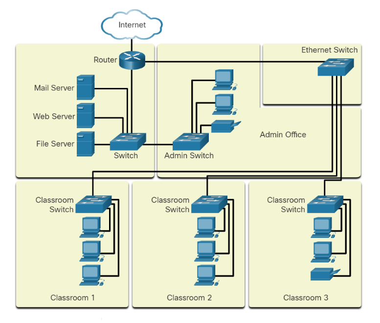
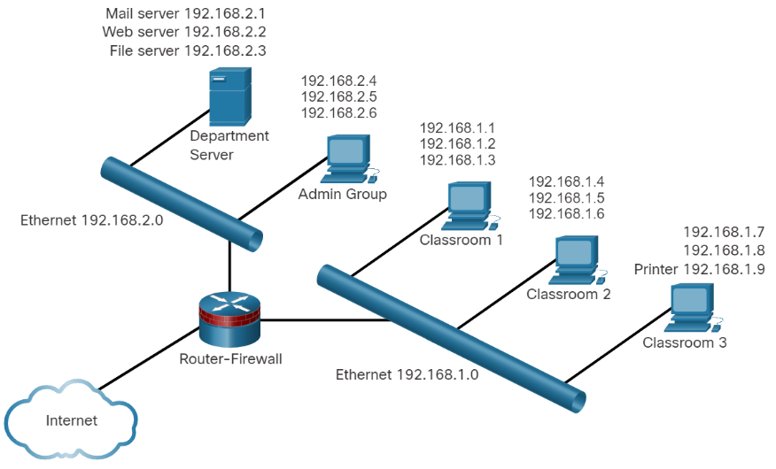

# Network Documentation

Tener una excelente documentación de la red te ayudará cuando conectes nuevos dispositivos o cuando haya problemas de conexión. Se deberá tener una documentación tanto física como lógica.

## Physical Topology

Muestra como los dispositivos se conectan entre sí, Muestra los servidores, routers que conectan al internet, switches y computadoras. En este, la red tiene que estar organizada de modo que los datos tengan que ir a su destino de la manera más eficaz.

## Logical Topology

Muestra cómo las diferentes áreas que están etiquetadas como IPs, Tipos de conexión, firewall, etc. Este tipo de mapa sirve para hacer troubleshooting, saber que conexión está rota y arreglarla. 

