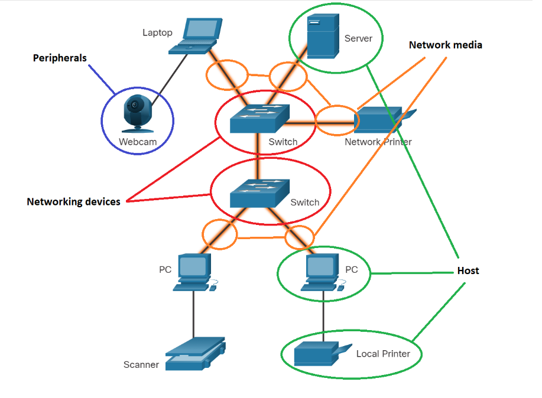

# Local Network

## Lan Components

### Components

   → **Host:** son aquellos que tienen contacto con el ser humano, como computadoras, celulares, etc.
   → **Peripherals**: son dispositivos que no se conectan directamente a la red, más bien requieren de Host para poder realizar todas las operaciones de red. Cómo; Webcams, Printers ,etc.
   → **Networking devices:** Connect other devices, mainly hosts. Determinan qué camino tomar en la red y monitorean la velocidad. Como; LAN Switches o Routers.
   → **Network media:** Puede ser wireless or wired provee el camino para que todos los mensajes lleguen de la fuente a su destino. Como; Cableado de cobre o fibra óptica, también ondas.

## Topologías

Para poder tener todo en un mejor orden se puede usar dos tipos de diagramas;
   → **Physical Topology:** Muestra como los dispositivos se conectan entre sí, Muestra los servidores, routers que conectan al internet, switches y computadoras.
   → **Logical Topology:** Muestra cómo las diferentes áreas están etiquetadas como IPs, Tipos de conexión, firewall, etc.

## Ethernet

Los dispositivos acceden a Ethernet usando Ethernet Network Interface Card (NIC). Cada NIC tiene una etiqueta única y permanente incrustada en la tarjeta conocida como Media Access Control (MAC) Address.

## End Device Adressing IP

Para poder conectarse a una network el host deberá tener una interfaz NIC. El NIC es un hardware que permite conectar a una red ya sea alámbrica o inalámbricamente, puede estar o no integrada a la tarjeta madre.

Muchas redes se conectan al internet para intercambiar información. Los host deberán tener IP address, así como otra información, para identificarse los unos a los otros. Se debe de tener correctamente tres configuraciones de una IP para que esta reciba información de la red:

   → **IP address:** This identifies the host on the network
   → **Subnet Mask:** This is used to identify the network on which the host is connected.
   → **Default gateway:** This identifies the networking device that the host uses to access the internet or another remote network

Most network applications use a domain name, such as [www.google.com](http://www.google.com), instead of an IP address when accessing information on the internet. A DNS server is used to translate the domain name to its IP address. Without an IP address of a DNS server, the user will have difficulty accessing the internet.

​	→ **DNS (Domain Name System):**  DNS works as a translator between the hostname (such as www.example.com) into a computer-friendly IP adress (such as 192.168.1.1)

Si tienes un servidor deberías configurar el IP y el DNS, o también un printer, la mayoría de Printers necesitarán un IP estático. 

## Configuración Manual vs Automática

### Manual IP Configuration

With manual configuration, the required values are entered into the device via the keyboard, typically by a network administrator. The IP address that is entered is referred to as a static address and must be unique on the network.

### Dynamic IP Configuration (DHCP)

Most end-user devices can be set up to receive network configuration information dynamically. This enables the device to request an address from a pool of addresses assigned by a **Dynamic Host Configuration Protocol (DHCP)** server located within the network.

Solo se deberá dejar manual si tienes un servidor o una impresora, de lo contrario se recomienda que se mantenga el IP dinámico.