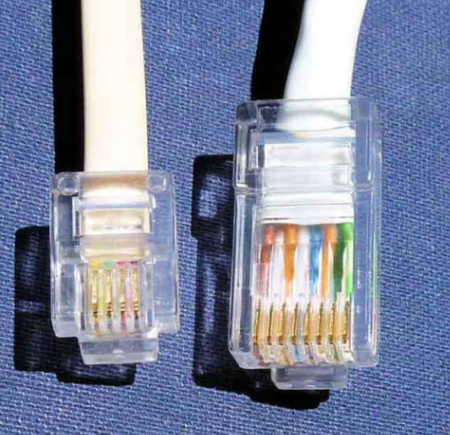
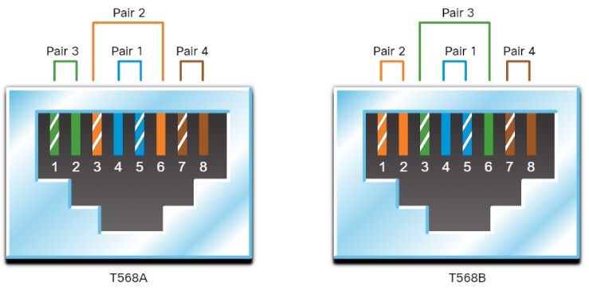
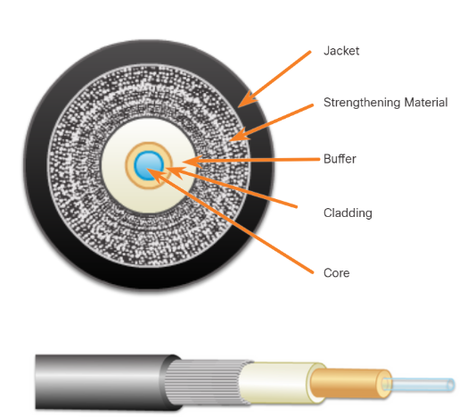

# Network Media Types

La comunicación se transmite por medio de network media. Network media provee el canal en el cual los mensajes viajan desde la fuente hasta el destino. 

Existen tres tipos de transmisión de datos; por señales eléctricas, por señales ópticas y por señales sin conexión.

## Electrical signal

### Twisted-Pair Cable (Ethernet Cabling)

Ethernet generalmente usa twisted-pair cables para conectarse. Ethernet es la base de la mayoría de las redes locales. 

Twisted-pair cables consist of one or more pairs of insulated copper wires that are twisted together and housed in a protective jacket. Like all copper cables, twisted-pair uses pulses of electricity to transmit data. Wires are grouped in pairs and twisted together to reduce interference. The pairs of wires are colored so that you can identify the same wire at each end. Typically, in each pair, one of the wires is a solid color and its partner is the same color striped onto a white background. 

Data transmission over copper cable is sensitive to electromagnetic interference (EMI), which can reduce the data throughput rate that a cable can provide. Common items in a home that can create **EMI** include **microwave ovens** and **fluorescent light fixtures**.

Another source of interference, known as crosstalk, occurs when cables are bundled together for long lengths. The electrical impulses from one cable can cross over to an adjacent cable. This occurs most frequently when cables are improperly installed and terminated. When data transmission is corrupted due to interference such as crosstalk, the data must be retransmitted. This can degrade the data carrying capacity of the medium.The figure illustrates how data transmission is affected by interference.

#### Types of Twisted-Pair Cables

There are two commonly installed types of twisted-pair cable:

• **Unshielded twisted-pair (UTP)** - This is the most commonly encountered type of network cable in North America and many other areas. UTP cable is inexpensive, offers a high bandwidth, and is easy to install. This type of cable is used to connect workstations, hosts and network devices. It can come with many different numbers of pairs inside the jacket, but the most common number of pairs is four. Each pair is identified by a specific color code.

• **Shielded cables (STP)** - These are used almost exclusively in European countries.There are electrical environments in which EMI and RFI are so strong that shielding is a requirement to make communication possible, such as in a factory. In this instance, it may be necessary to use a cable that contains shielding, such as shielded twisted-pair (STP). Unfortunately, STP cables are very expensive, not as flexible, and have additional requirements because of the shielding that make them difficult to work with.

Many different categories of UTP cables have been developed over time, as shown in the table. Each category of cable was developed to support a specific technology and most are no longer encountered in homes or offices. The cable types which are still commonly found include Categories 3, 5, 5e, and 6.

|  Category  |         Speed         |                           Features                           |
| :--------: | :-------------------: | :----------------------------------------------------------: |
| Cat 3 UTP  |  10 Mbps at 16 MHz.   | Suitable for Ethernet LANs. Most often used for phone lines. |
| Cat 5 UTP  | 100 Mbps at 100 MHz.  | Manufactured with a higher standard than Cat 3 to allow for higher data transfer rates. |
| Cat 5e UTP | 1000 Mbps at 100 MHz. | Manufactured with higher standard than Cat 5 to allow for higher data transfer rates. More twists per foot than Cat 5 to better prevent EMI and RFI from outside sources. |
| Cat 6 UTP  | 1000 Mbps at 250 MHz. | Manufactured with higher standard than Cat 5eMore twists per foot than Cat 5 to better prevent EMI and RFI from outside sources |
| Cat 6a UTP | 1000 Mbps at 500 MHz  |                                                              |
| Cat 7 ScTP |  10 Gbps at 600 MHz   |                                                              |

All categories of data grade UTP cable are traditionally terminated into an **RJ-45** connector. There are still some applications that require the smaller **RJ-11** connector, such as analog phones and some fax machines. In the figure below, an example of an RJ-11 connector is on the left. The RJ-45 connector is on the right.

#### Twisted-Pair Wiring Schemes

The color coding of the wire pairs in an UTP cable is determined by the type of standard that is used to make the cable. Different standards have different purposes and are closely governed by the standards organizations.

For typical Ethernet installations, there are two standards that are widely implemented. The TIA/EIA organization defines two different patterns, or wiring schemes, called T568A and T568B, as shown in the figure. Each wiring scheme defines the pinout, or order of wire connections, on the end of the cable.

On a network installation, one of the two wiring schemes (T568A or T568B) should be chosen and followed. It is important that the same wiring scheme is used for every termination in that project.

Ethernet NICs and the ports on networking devices are designed to send data over UTP cables. Specific pins on the connector are associated with a transmit function and a receive function. The interfaces on each device are designed to transmit and receive data on designated wires within the cable.

When two devices are directly connected using an UTP Ethernet cable, it is important that the transmit function and the receive function on each end of the cable are reversed. One device sends data on a specific set of wires and the device on the other end of the cable listens for the data on the same wires.

Two devices that use different wires for transmit and receive are known as **unlike devices**. They require a **straight-through cable** to exchange data. Straight-through cables have the same color patterns on both ends of the cable.

Devices that are directly connected and use the same pins for transmit and receive, are known as **like devices**. They require the use of a **crossover cable** in order to reverse the transmit function and receive function so that the devices can exchange data.

### Coaxial Cable

Coaxial was one of the earliest types of network cabling developed. Coaxial cable (or coax) carries data in the form of electrical signals. It provides improved shielding compared to UTP and can therefore carry more data. 

Coaxial cable has a single rigid copper core that conducts the signal. This core is typically surrounded by a layer of insulation, braided metal shielding, and a protective jacket. It is used as a high-frequency transmission line to carry high-frequency or broadband signals. It is used by cable television companies to provide service and for connecting the various components that make up satellite communication systems. 

coaxial cables used to connect a TV set to the signal source, be it a cable TV outlet, satellite TV, or conventional antenna in your home. With the addition of a cable modem, the cable television provider can offer data and internet service, as well as television signals and telephone over the same coaxial cable. Although coax has improved data carrying characteristics, twisted-pair cabling has replaced coax in local area networking uses. Among the reasons for the replacement is that compared to UTP, coax is physically harder to install, more expensive, and harder to troubleshoot.

## Optical signal

### Fiber-Optic Cable

Unlike UTP and coax, fiber-optic cables transmit data using pulses of light. Although not normally found in home or small business environments, fiber-optic cabling is widely used in enterprise environments and large data centers.

Fiber-optic cable can be either glass or plastic with a diameter about the same as a human hair and it can carry digital information at very high speeds over long distances. Because light is used instead of electricity, electrical interference does not affect the signal. 

Fiber-optic cables have many uses as well as communications. Fiber connections are a good choice to extend networks from one building to another, both because of distance considerations and because fiber cables are more resistant to outdoor environmental conditions than copper cables. Each fiber-optic circuit is actually two fiber cables. One is used to transmit data; the other is used to receive data.

They have a very high bandwidth, which enables them to carry very large amounts of data. Fiber is used in backbone networks, large enterprise environments, and large data centers. It is also used extensively by telephone companies.

 In the figure below, the parts of a fiber-optic cable are as follows:

- **Jacket** - Typically a PVC jacket that protects the fiber against abrasion, moisture, and other contaminants. This outer jacket composition can vary depending on the cable usage.
- **Strengthening Material** - Surrounds the buffer, prevents the fiber cable from being stretched when it is being pulled. The material used is often the same material used to produce bulletproof vests.
- **Buffer** - Used to help shield the core and cladding from damage.
- **Cladding** - Made from slightly different chemicals than those used to create the core. It tends to act like a mirror by reflecting light back into the core of the fiber. This keeps light in the core as it travels down the fiber.
- **Core** - The core is actually the light transmission element at the center of the optical fiber. This core is typically silica or glass. Light pulses travel through the fiber core.

Fiber-optic cables can reach distances of several miles or kilometers before the signal needs to be regenerated. Either lasers or light emitting diodes (LEDs) generate the light pulses that are used to represent the transmitted data as bits on the media. 

In addition to its resistance to EMI, fiber-optic cables support a large amount of bandwidth, making them ideally suited for high-speed data networks. 

Bandwidth on fiber-optic links can reach speeds of 100 Gbps and is continually increasing as standards are developed and adopted. Fiber-optic links are found in many corporations and are also used to connect ISPs on the internet.

