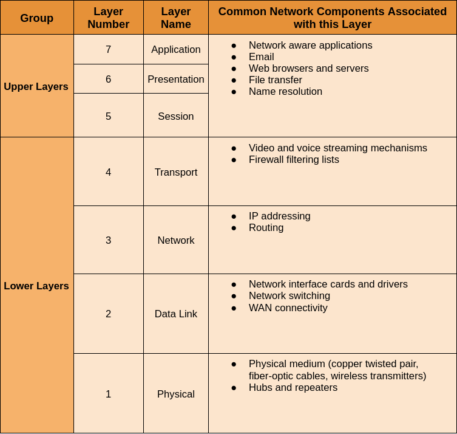

# Network Communication Models

Existen tres elementos en la comunicación entre computadoras;
• **Sender:** Es la computadora que envía el mensaje
• **Receiver:** Es la computadora que recibe el mensaje
• **Channel**: Es el medio por el cual el mensaje se envía

Las computadoras solo saben su propio IP. Gracias a los protocolos las computadoras se pueden comunicar entre sí, los protocolos son reglas que determinan la comunicación entre computadoras. Para una correcta comunicación se necesita una interacción entre varios protocolos, desde software hasta hardware.

## Protocolos

| Protocolo | Descripción                                                  |
| --------- | ------------------------------------------------------------ |
| HTTP      | Gobierna el camino en el que un servidor web y un cliente interactúan. |
| TCP       | Es el responsable de que un mensaje sea entregado correctamente. |
| IP        | Es el responsable de entregar un mensaje desde el host hasta el cliente. |
| Ethernet  | Es el responsable de entregar un mensaje de un Host a otro dentro de la misma red local (LAN) |

Existen dos tipos de modelos que describen las funciones que ocurren para que la comunicación en una red sea efectiva

   → **Protocol Model:** Estructura que describe lo que se requiere para que el usuario se comunique con la red. El modelo TCP/IP es un modelo de protocolo porque describe las funciones que se producen en cada capa de protocolos dentro del conjunto TCP/IP.

   → **Reference Protocol:** Este tipo de modelo describe las funciones que se deben de cumplir dentro de cada capa, pero no especifica exactamente cómo deben ser cumplidas. El propósito primario es ayudar a aclarar las funciones y los procesos para la comunicación entre redes.

## OSI Model

El modelo OSI fue creado por la *organización internacional de normalización* (**ISO**) en los 80’s para la comunicación entre sistemas.

Este modelo está dividido en 7 capas, estas 7 capas son una serie de pasos en los cuales será posible la comunicación entre dispositivos, en cada una de estas capas es donde se incluye cierto tipo de información.

1. **Capa (Física):** Describe los medios mecánicos, eléctricos, funcionales y procedimentales para activar, mantener y desactivar conexiones físicas para la transmisión de bits.
2. **Capa (Enlace de datos):** Describe los métodos de intercambio de datos entre dispositivos sobre un mismo medio. Es decir transforma los paquetes en bits para que la capa física los envíe.
3. **Capa (Red):** Provee los servicios de intercambio de paquetes sobre la red entre dispositivos identificados. Es decir, se encarga de determinar la mejor ruta para que el mensaje llegue al otro dispositivo.
4. **Capa (Transporte):** Define los segmentos, transfiere y ordena los datos para una comunicación individual entre dispositivos. En pocas palabras, segmenta los datos (paquetes) para ser enviados a través de **UDP** o **TCP**.
5. **Capa (Sesión):** Provee servicios a la capa de presentación para organizar el diálogo y gestionar el intercambio de datos. La función de esta capa es que no se corte la comunicación a la mitad de una conversación.
6. **Capa (Presentación):** Proporciona una representación común de los datos transferidos entre los servicios de la capa de aplicación. Es decir, se encarga de traducir la información al formato que usted desea ver.
7. **Capa (Aplicación):** Se definen los protocolos que utilizan las aplicaciones para intercambiar datos como SMTP, FTP, gestores de bases de datos, etc. En pocas palabras es la aplicación que usted puede ver.

### ¿Como funciona?

7. Capa de aplicación (Application Layer): La aplicación que genera los datos los encapsula en un paquete y lo envía a la capa de presentación.
2. Capa de presentación (Presentation Layer): La capa de presentación se encarga de codificar los datos en un formato que pueda ser interpretado por la capa de sesión.
3. Capa de sesión (Session Layer): La capa de sesión establece, administra y termina sesiones de comunicación entre dispositivos.
4. Capa de transporte (Transport Layer): La capa de transporte se encarga de garantizar la entrega confiable de los datos a través del uso de mecanismos de control de flujo y detección y corrección de errores.
5. Capa de red (Network Layer): La capa de red se encarga de seleccionar la ruta más adecuada para el paquete y controlar la congestión en la red.
6. Capa de enlace de datos (Data Link Layer): La capa de enlace de datos se encarga de garantizar la entrega confiable de los datos a través de la detección y corrección de errores y control de flujo.
7. Capa física (Physical Layer): La capa física se encarga de transmitir los bits que componen el paquete a través del medio físico, como un cable de cobre o fibra óptica.

### OSI Model Table

## TPC/IP Model

El modelo OSI ya no es usado actualmente, por su parte fue cambiado por el modelo TCP/IP. Este recorta algunas capas.

| Model Layers   | Description                                                  |
| -------------- | ------------------------------------------------------------ |
| Application    | Represents data to the user, plus encoding and dialog control. |
| Transport      | Supports communication between various devices across diverse networks. |
| Internet       | Determines the best path through network.                    |
| Network Access | Controls the hardware devices and the media that make up the network. |

### ¿Cómo funciona?

1. Capa de aplicación (Application Layer): La aplicación que genera los datos los encapsula en un paquete y lo envía a la capa de transporte.
2. Capa de transporte (Transport Layer): La capa de transporte se encarga de garantizar la entrega confiable de los datos a través del uso de protocolos como TCP o UDP. Utiliza mecanismos de control de flujo y detección y corrección de errores.
3. Capa de red (Internet Layer): La capa de red se encarga de seleccionar la ruta más adecuada para el paquete y controlar la congestión en la red. Utiliza direcciones IP para identificar a los dispositivos en la red.
4. Capa de enlace (Link Layer): La capa de enlace se encarga de transmitir los datos a través del medio físico. Proporciona servicios de acceso al medio y control de errores para la capa de red.

## Ethernet Frame

### Encapsulation

Cuando se envía un mensaje se encapsula en un formato para ser enviado, cada formato se le nombra frame, antes de ser enviado a la red. El frame funciona como un sobre de una carta, contiene la dirección del destinatario y la dirección del host. El formato y el contenido del frame son determinados por el tipo de mensaje y el canal en el cual se realiza la comunicación.

### Ethernet Frame

Cuando un mensaje es enviado a través de una red ethernet, el host le da un formato a los mensajes. El formato para ethernet frames especifica la ubicación del destinatario y la fuente del mac addresses e información adicional como:
   → Preamble of sequencing andTiming
   → Start of frame delimiter
   → Length and type of frame
   → Frame check to detect transmission errors

The size of Ethernet frames is normally limited to a maximum of 1518 bytes and a minimum size of 64 bytes from the Destination MAC Address field through the Frame Check Sequence (FCS). The preamble and the Start of Frame Delimiter (SFD) are used to indicate the beginning of the frame. They are not used in the calculation of the frame size. 

Frames that do not match these limits are not processed by the receiving hosts. In addition to the frame formats, sizes and timing, Ethernet standards define how the bits making up the frames are encoded onto the channel. 

Bits are transmitted as either electrical impulses over copper cable or as light impulses over fiber-optic cable. Los frames también se conocen como la capa 2 (Protocol Data) del **modelo OSI**.

### IEEE

The IEEE publishes the current Ethernet standards?

### Mac Address

Es la etiqueta numérica del dispositivo puesto por el fabricante.
