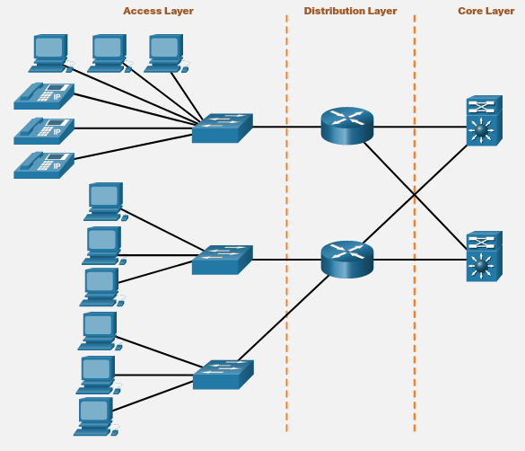

# Network Design


## Physical and Logical Addresses


### Physical

A person's name usually does not change. A person's address on the other hand, relates to where the person lives and can change. On a host, the MAC address does not change; it is physically assigned to the host NIC and is known as the physical address. The physical address remains the same regardless of where the host is placed on the network.


### Logical

The IP address is similar to the address of a person. It is known as a logical address because it is assigned logically based on where the host is located. The IP address, or network address, is assigned to each host by a network administrator based on the local network.

IP addresses contain two parts. One part identifies the network portion. The network portion of the IP address will be the same for all hosts connected to the same local network. The second part of the IP address identifies the individual host on that network. Within the same local network, the host portion of the IP address is unique to each host, as shown in the figure.


```bash
#Network Portion
192.168.1

#Host Portion
Computer1 (192.168.1.2)
Computer2 (192.168.1.3)
```


Both the physical MAC and logical IP addresses are required for a computer to communicate on a hierarchical network, just like both the name and address of a person are required to send a letter.

La porción de Network address y Host address lo va a definir el  "Subnet Mask". El subet mask revela cuantos bits en el IP address son utilizados para el network address.

En el subet mask el número "255" significa "1" y el número "0" significa cero. Todas las porciones que digan 255 significan que serán utilizadas para el network address.

```bash
#IPV4
192.168.1.2

#Subnet Mask
255.255.255.0

```

En este ejemplo nos indica que las primeras tres porciones serán utilizadas para el network adress. es decir: 192.168.1, después del uno la siguiente porción será utilizada para el host adress.


## Benefits of Hierarchical Design

In networking, hierarchical design is used to group devices into multiple networks that are organized in a layered approach. This method of designing networks consists of smaller, more manageable groups that allow local traffic to remain local. Only traffic that is destined for other networks is moved to a higher layer.

the hierarchical design has three basic layers:

1. **Access Layer:** This layer provides connections to hosts in a local Ethernet network.
2. **Distribution Layer:** This layer interconnects the smaller local networks.
3. **Core Layer:** This layer provides a high-speed connection between distribution layer devices.




With a hierarchical design, there is a need for a logical addressing scheme that can identify the location of a host. The most common addressing scheme on the internet is Internet Protocol version 4 (IPv4). But we also have an IPv6, so when we refer to IP it means both IPs versions.


### Access Layer

The access layer provides a connection point for end user devices to the network and allows multiple hosts to connect to other hosts through a network device, usually a switch or a wireless access point. Typically, all devices within a single access layer will have the same network portion of the IP address.

If a message is destined for a local host, based on the network portion of the IP address, the message remains local. If it is destined for a different network, it is passed up to the distribution layer.


### Distribution Layer

The distribution layer provides a connection point for separate networks and controls the flow of information between the networks. It typically contains more powerful switches than the access layer as well as routers for routing between networks. 

Distribution layer devices control the type and amount of traffic that flows from the access layer to the core layer.


### Core Layer

The core layer is a high-speed backbone layer with redundant (backup) connections. It is responsible for transporting large amounts of data between multiple end networks. Core layer devices typically include very powerful, high-speed switches and router.

The main goal of the core layer is to transport data quickly.

