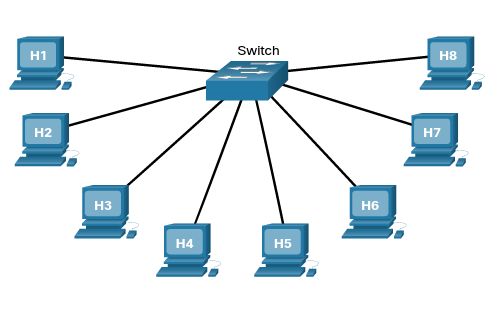
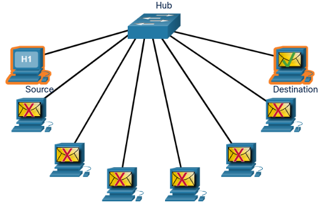
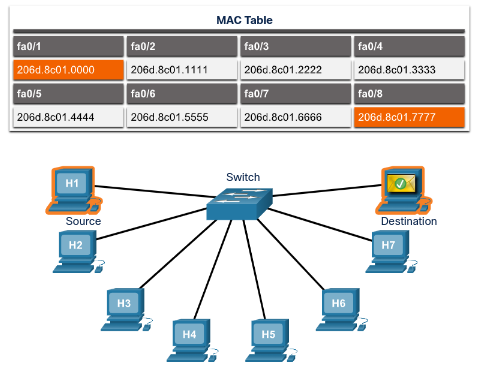
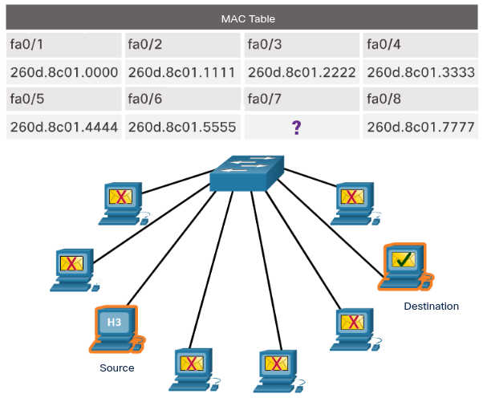

# The Access Layer

## Access Layer Devices

The access layer is the basic level of the network. It is the part of the network in which people gain access to other hosts and to shared files and printers. The access layer provides the first line of networking devices that connect hosts to the wired Ethernet network.

Networking devices enable us to connect many hosts with each other and also provide those hosts access to services offered over the network. Unlike the simple network consisting of two hosts connected by a single cable, in the access layer, each host is connected to a networking device. 

Within an Ethernet network, each host is able to connect directly to an access layer networking device using an Ethernet cable. These cables are manufactured to meet specific Ethernet standards. Each cable is plugged into a host NIC and then into a port on the networking device. There are several types of networking devices that can be used to connect hosts at the access layer, including Ethernet switches.

## Hubs

The original Ethernet networks connected all hosts with a single cable, similar to how cable TV cables are connected in your home. All users on the network shared the bandwidth available on the cable. As Ethernet networks became more popular, connecting everyone on a single cable was no longer practical, nor even possible. Engineers developed a different type of network technology that made it easier to connect and reconnect multiple devices to the network. The first of these types of networking devices were Ethernet hubs.

Hubs contain multiple ports that are used to connect hosts to the network. Hubs are simple devices that do not have the necessary electronics to decode the messages sent between hosts on the network. Hubs cannot determine which host should get any particular message. A hub simply accepts electronic signals from one port and regenerates (or repeats) the same message out all of the other ports. All hosts attached to the hub share the bandwidth, and will receive the message. Hosts ignore the messages that are not addressed to them. Only the host specified in the destination address of the message processes the message and responds to the sender.

Only one message can be sent through an Ethernet hub at a time. It is possible for two or more hosts connected to a hub to attempt to send a message at the same time. If this happens, the electronic signals that make up the messages collide with each other at the hub. This is known as a collision. The message is unreadable by hosts and must be retransmitted. The area of the network where a host can receive a garbled message resulting from a collision is known as a collision domain.

Because excessive retransmissions can clog up the network and slow down network traffic, hubs are now considered obsolete and have been replaced by Ethernet switches.

## Ethernet Switches

An Ethernet switch is a device that is used at the access layer. When a host sends a message to another host connected to the same switched network, the switch accepts and decodes the frames to read the physical (MAC) address portion of the message.

A table on the switch, called a MAC address table, contains a list of all of the active ports and the host MAC addresses that are attached to them. When a message is sent between hosts, the switch checks to see if the destination MAC address is in the table. If it is, the switch builds a temporary connection, called a circuit, between the source and destination ports. This new circuit provides a dedicated channel over which the two hosts can communicate. Other hosts attached to the switch do not share bandwidth on this channel and do not receive messages that are not addressed to them. A new circuit is built for every new conversation between hosts. These separate circuits allow many conversations to take place at the same time, without collisions occurring. Ethernet switches also allow for the sending and receiving of frames over the same Ethernet cable simultaneously. This improves the performance of the network by eliminating collisions.

## Mac Address Table

What happens when the switch receives a frame addressed to a new host that is not yet in the MAC address table? If the destination MAC address is not in the table, the switch does not have the necessary information to create an individual circuit. When the switch cannot determine where the destination host is located, it uses a process called flooding to forward the message out to all attached hosts except for the sending host. Each host compares the destination MAC address in the message to its own MAC address, but only the host with the correct destination address processes the message and responds to the sender.

How does the MAC address of a new host get into the MAC address table? A switch builds the MAC address table by examining the source MAC address of each frame that is sent between hosts. When a new host sends a message or responds to a flooded message, the switch immediately learns its MAC address and the port to which it is connected. The table is dynamically updated each time a new source MAC address is read by the switch. In this way, a switch quickly learns the MAC addresses of all attached hosts.