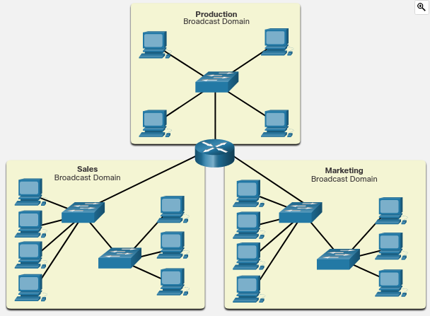
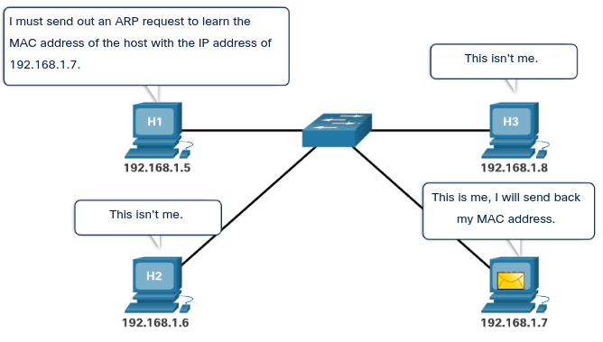

# Broadcast Containment

## Ethernet Broadcast in the local network

Within the local network it is often necessary for one host to be able to send messages to all the other hosts at the same time. This can be done using a message known as a broadcast. Broadcasts are useful when a host needs to find information without knowing exactly what other host can supply it, or when a host wants to provide information to all other hosts in the same network in a timely manner.

A message can only contain one destination MAC address. So, how is it possible for a host to contact every other host on the local network without sending out a separate message to each individual MAC?

To solve this problem, broadcast messages are sent to a unique MAC address that is recognized by all hosts. The broadcast MAC address is actually a 48-bit address made up of all ones. Because of their length, MAC addresses are usually represented in hexadecimal notation. The broadcast MAC address in hexadecimal notation is FFFF.FFFF.FFFF. Each F in the hexadecimal notation represents four ones in the binary address.

## Broadcast Domains

When a host receives a message addressed to the broadcast address, it accepts and processes the message as though the message was addressed directly to it. When a host sends a broadcast message, switches forward the message to every connected host within the same local network. For this reason, a local area network, a network with one or more Ethernet switches, is also referred to as a broadcast domain.

If too many hosts are connected to the same broadcast domain, broadcast traffic can become excessive. The number of hosts and the amount of network traffic that can be supported on the local network is limited by the capabilities of the switches used to connect them. As the network grows and more hosts are added, network traffic, including broadcast traffic, increases. To improve performance, it is often necessary to divide one local network into multiple networks, or broadcast domains, as shown in the figure. Routers are used to divide the network into multiple broadcast domains

## Access Layer Communication

On a local Ethernet network, a NIC only accepts a frame if the destination address is either the broadcast MAC address, or else corresponds to the MAC address of the NIC.

Most network applications, however, rely on the logical destination IP address to identify the location of the servers and clients. The figure illustrates the problem that arises if a sending host only has the logical IP address of the destination host. How does the sending host determine what destination MAC address to place within the frame?

The sending host can use an IPv4 protocol called address resolution protocol (ARP) to discover the MAC address of any host on the same local network. IPv6 uses a similar method known as Neighbor Discovery.

## ARP (Address Resolution Protocol)

ARP uses a three step process to discover and store the MAC address of a host on the local network when only the IPv4 address of the host is known:

1. The sending host creates and sends a frame addressed to a broadcast MAC address. Contained in the frame is a message with the IPv4 address of the intended destination host.
2. Each host on the network receives the broadcast frame and compares the IPv4 address inside the message with its configured IPv4 address. The host with the matching IPv4 address sends its MAC address back to the original sending host.
3. The sending host receives the message and stores the MAC address and IPv4 address information in a table called an ARP table.

When the sending host has the MAC address of the destination host in its ARP table, it can send frames directly to the destination without doing an ARP request. Because ARP messages rely on broadcast frames to deliver the requests, all hosts in the local IPv4 network must be in the same broadcast domain.

