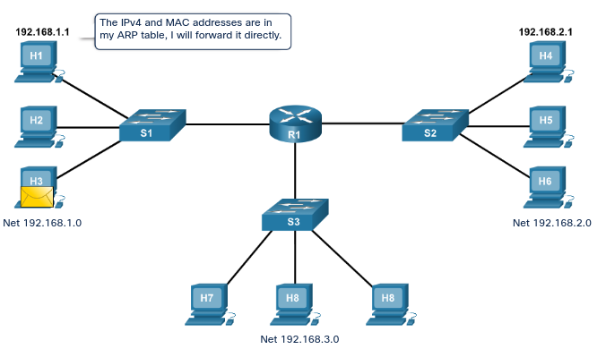
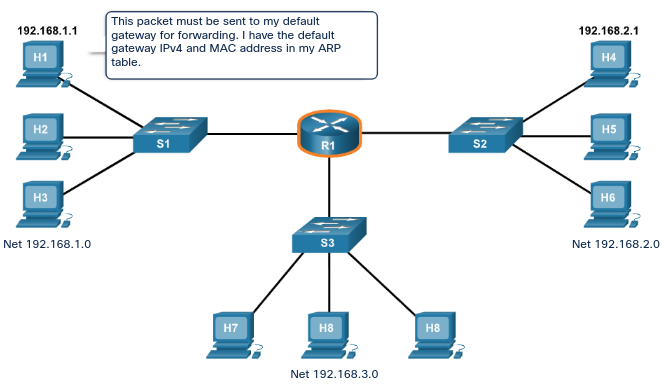
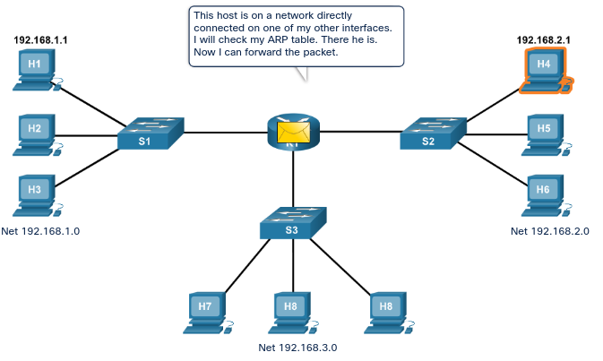

# Routing Between Networks

## Criteria for Dividing the Local Network

As networks grow, it is often necessary to divide one access layer network into multiple access layer networks. There are many ways to divide networks based on different criteria:

- Broadcast containment
- Security requirements
- Physical locations
- Logical grouping

The distribution layer connects these independent local networks and controls the traffic flowing between them. It is responsible for ensuring that traffic between hosts on the local network stays local. Only traffic that is destined for other networks is passed on. The distribution layer can also filter incoming and outgoing traffic for security and traffic management.

Networking devices that make up the distribution layer are designed to interconnect networks, not individual hosts. Individual hosts are connected to the network via access layer devices, such as switches. The access layer devices are connected to each other via the distribution layer device, such as a router.

## Routing

In most situations we want our devices to be able to connect beyond our local network: out to other homes, businesses, and the internet. Devices that are beyond the local network segment are known as remote hosts. When a source device sends a packet to a remote destination device, then the help of routers and routing is needed. Routing is the process of identifying the best path to a destination.

A router is a networking device that connects multiple Layer 3, IP networks. At the distribution layer of the network, routers direct traffic and perform other functions critical to efficient network operation. Routers, like switches, are able to decode and read the messages that are sent to them. Unlike switches, which make their forwarding decision based on the Layer 2 MAC address, routers make their forwarding decision based on the Layer 3 IP address.

The packet format contains the IP addresses of the destination and source hosts, as well as the message data being sent between them. The router reads the network portion of the destination IP address and uses it to find which one of the attached networks is the best way to forward the message to the destination.

Anytime the network portion of the IP addresses of the source and destination hosts do not match, a router must be used to forward the message. If a host located on network 1.1.1.0 needs to send a message to a host on network 5.5.5.0, the host will forward the message to the router. The router receives the message, de-encapsulates the Ethernet frame, and then reads the destination IP address in the IP packet. It then determines where to forward the message. It re-encapsulates the packet back into a new frame, and forwards the frame on to its destination.

## Path Selection

How does the router determine which interface to use to send the message on a path to get to the destination network?

Each port, or interface, on a router connects to a different local network. Every router contains a table of all locally connected networks and the interfaces that connect to them. These routing tables can also contain information about the routes, or paths, that the router uses to reach other remote networks that are not locally attached.

When a router receives a frame, it decodes the frame to get to the packet containing the destination IP address. It matches the network portion of the destination IP address to the networks that are listed in the routing table. If the destination network address is in the table, the router encapsulates the packet in a new frame in order to send it out. (Note that it will insert a new destination MAC address as well, and recalculate the FCS field, in the new frame). It forwards the new frame out of the interface associated with the path, to the destination network. The process of forwarding the packets toward their destination network is called routing.

Router interfaces do not forward messages that are addressed to the local network broadcast IP address. As a result, local network broadcasts are not sent across routers to other local networks.

## Packet Forwarding

A router forwards a packet to one of two places: a *directly connected network containing the actual destination host*, or to *another router on the path to reach the destination host*. When a router encapsulates the frame to forward it out an Ethernet interface, it must include a destination MAC address.

This is the MAC address of the actual destination host, if the destination host is part of a network that is locally connected to the router. If the router must forward the packet to another router through an Ethernet interface, it will use the MAC address of the connected router. Routers obtain these MAC addresses from ARP tables.

Each router interface is part of the local network to which it is attached and maintains its own ARP table for that network. The ARP tables contain the MAC addresses and IPv4 addresses of all the individual hosts on that network.

### Direct Path

### Routing

## Routing Table

Routers move information between local and remote networks. To do this, routers must use routing tables to store information. Routing tables are not concerned with the addresses of individual hosts. Routing tables contain the addresses of networks, and the best path to reach those networks. Entries can be made to the routing table in two ways: dynamically updated by information received from other routers in the network, or manually entered by a network administrator. Routers use the routing tables to determine which interface to use to forward a message to its intended destination.

If the router cannot determine where to forward a message, it will drop it. Network administrators configure a static default route that is placed into the routing table so that a packet will not be dropped due to the destination network not being in the routing table. A default route is the interface through which the router forwards a packet containing an unknown destination IP network address. This default route usually connects to another router that can forward the packet towards its final destination network.

## Default Gateway

The method that a host uses to send messages to a destination on a remote network differs from the way a host sends messages on the same local network. When a host needs to send a message to another host located on the same network, it will forward the message directly. A host will use ARP to discover the MAC address of the destination host. The IPv4 packet contains the destination IPv4 address and encapsulates the packet into a frame containing the MAC address of the destination and forwards it out.

When a host needs to send a message to a remote network, it must use the router. The host includes the IP address of the destination host within the packet just like before. However, when it encapsulates the packet into a frame, it uses the MAC address of the router as the destination for the frame. In this way, the router will receive and accept the frame based on the MAC address.

How does the source host determine the MAC address of the router? A host is given the IPv4 address of the router through the default gateway address configured in its TCP/IP settings. **The default gateway address is the address of the router interface connected to the same local network as the source host**. All hosts on the local network use the default gateway address to send messages to the router. When the host knows the default gateway IPv4 address, it can use ARP to determine the MAC address. The MAC address of the router is then placed in the frame, destined for another network.

It is important that the correct default gateway be configured on each host on the local network. If no default gateway is configured in the host TCP/IP settings, or if the wrong default gateway is specified, messages addressed to hosts on remote networks cannot be delivered.

*A default gateway is a device that forwards data from one network to another, in the majority of the time, is going to be a router.*

