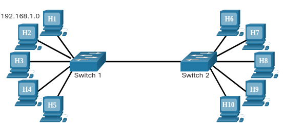
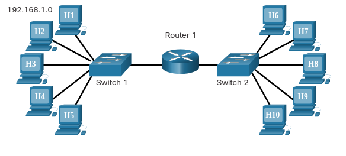

# Local Area Networks (LAN)

The term local area network (LAN) refers to a local network, or a group of interconnected local networks that are under the same administrative control. In the early days of networking, LANs were defined as small networks that existed in a single physical location. Although LANs can be a single local network installed in a home or small office, the definition of LAN has evolved to include interconnected local networks consisting of many hundreds of hosts, installed in multiple buildings and locations.

The important thing to remember is that all the local networks within a LAN are under one administrative control. Other common characteristics of LANs are that they typically use Ethernet or wireless protocols, and they support high data rates.

The term intranet is often used to refer to a private LAN that belongs to an organization, and is designed to be accessible only by the members of the organization , employees, or others with authorization.

## Segmentation

Within a LAN, it is possible to place all hosts on a single local network or divide them up between multiple networks connected by a distribution layer device. How this placement is determined depends on desired results.

### All Hosts in One Local Segment

Placing all hosts on a single local network allows them to be seen by all other hosts. This is because there is one broadcast domain and hosts use ARP to find each other.

In a simple network design, it may be beneficial to keep all hosts within a single local network. However, as networks grow in size, increased traffic will decrease network performance and speed. In this case, it may be beneficial to move some hosts onto a remote network.

**Advantages of a single local segment:**

- Appropriate for simpler networks
- Less complexity and lower network cost
- Allows devices to be "seen" by other devices
- Faster data transfer - more direct communication
- Ease of device access

**Disadvantages of a single local segment:**

- All hosts are in one broadcast domain which causes more traffic on the segment and may slow network performance
- Harder to implement QoS
- Harder to implement security

### Hosts on a Remote Segment

Placing additional hosts on a remote network will decrease the impact of traffic demands. However, hosts on one network will not be able to communicate with hosts on the other without the use of routing. Routers increase the complexity of the network configuration and can introduce latency, or time delay, on packets sent from one local network to the other.

**Advantages:**

- More appropriate for larger, more complex networks
- Splits up broadcast domains and decreases traffic
- Can improve performance on each segment
- Makes the machines invisible to those on other local network segments
- Can provide increased security
- Can improve network organization

**Disadvantages:**

- Requires the use of routing (distribution layer)
- Router can slow traffic between segments
- More complexity and expense (requires a router)

