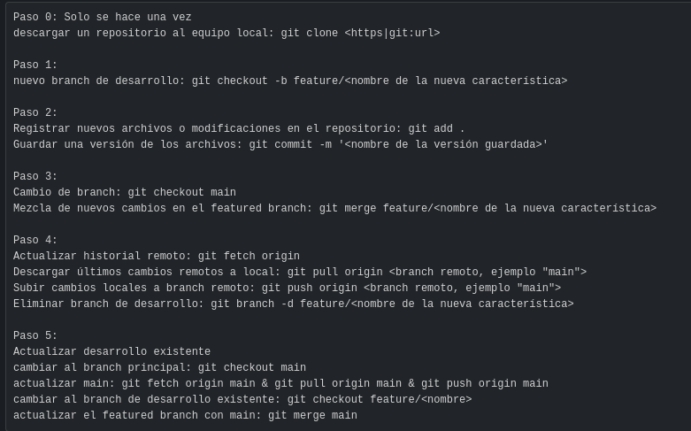
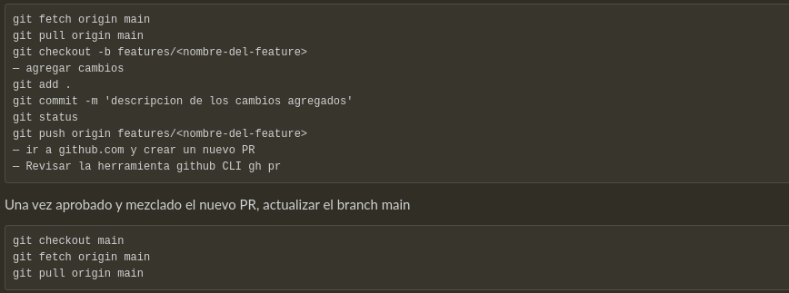

# Git Commands

## Basic Commands

These are some basic commands to use git.

### Setting up

| Code                       | Description                                              |
| -------------------------- | -------------------------------------------------------- |
| apt install git-all        | Git installation.                                        |
| git init                   | Creará un nuevo repositorio (solo se utilizará una vez). |
| git status / git status -s | Muestra el estado del repositorio.                       |

#### Git status symbols

   → ??: No reconocido
   → A: Reconocido
   → M: modificado

### Save files to local rep

| Code                                       | Description                                                  |
| ------------------------------------------ | ------------------------------------------------------------ |
| git add "filename"                         | Agregará un archivo desde la área working directory a la área temporal stagging area. |
| git add .                                  | Agregará todos los archivos desde el working directory al stagging area. |
| git commit -m "commit description message" | Del stagging area pasará al repositorio local.               |

### Log

| Code              | Description                                                  |
| ----------------- | ------------------------------------------------------------ |
| git log --oneline | Consultará el log, esto permite ver las acciones que se han realizado. |

### Revert save

| Code                             | Description                                                  |
| -------------------------------- | ------------------------------------------------------------ |
| git reset --hard "identificador" | Para poder regresar al archivo que se tenía anteriormente guardado. |

### Working Online

| Code                            | Description                                                  |
| ------------------------------- | ------------------------------------------------------------ |
| git remote add origin "rep url" | connect to an online rep.                                    |
| git push -u origin "branch"     | Se mandará los archivos guardados y se creará un upstream. (El upstream sirve para conectar el local rep y el online rep, posteriormente se puede utilizar sin el modificador "-u") |
| git push origin "branch"        | Se mandará los archivos del local rep al online rep.         |
| git push                        | Se mandará los archivos del local rep al online rep.         |
| git fetch origin "branch"       | Descargará todos los cambios hechos pero no modificará tus cambios locales, esto es para poder ver que se ha realizado. |
| git pull origin "branch"        | Descargará del repositorio online y modificará los archivos locales. |
| git clone "url"                 | Clonará un repositorio online.                               |

### Working with versions

| Code                                               | Description                                       |
| -------------------------------------------------- | ------------------------------------------------- |
| git tag "nombre del tag" -m  “mensaje descriptivo” | Creará un tag para saber el número de la versión. |
| git push --tag                                     | Subirá al online rep los tags utilizados          |

### Working with different branches

"Branches" son lineas de tiempo paraleleas que despúes de puede juntar, es decir, un trabajo paralelo que después se puede juntar con el trabajo principal.

| Code                                | Description                                                  |
| ----------------------------------- | ------------------------------------------------------------ |
| git branch "nombre de la rama"      | Se creará una nueva rama.                                    |
| git checkout "nombre de la rama"    | Se moverá de una rama a otra                                 |
| git checkout -b "nombre de la rama" | Se creará una nueva rama y se cambiará a ella.               |
| git branch -d "nombre de la rama"   | Se borrara una rama.                                         |
| git merge "nombre de la rama"       | Se combinarán los archivos de esta rama con la rama principal. |
| git branch                          | Se listaran las ramas                                        |

## Work flow example

