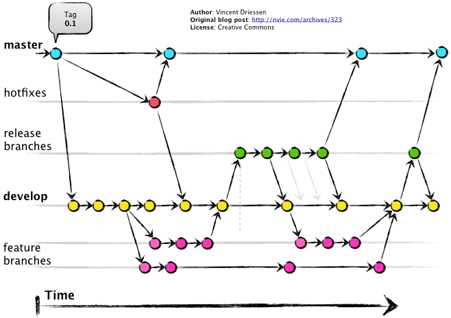

## Git flow

## Descripción de ramas

### Master 

La rama master solo se utiliza cuando se vaya a lanzar una nueva verisón del código y para nada más.  

#### Primera versión 

Para utilizar el programa primeramente se creará la primera verisón del programa en la rama master, a la cual se le creará un tag, para saber que versión es y un commit para guardarlo. Esto será nuestra primera versión.

### Develop

Esta rama llevará todas las correciones de código del proyecto y actualizaciones nuevas.

### Feature

Es donde se trabajará el código y una vez listo se fusionará con la rama develop.

### Release

Es la rama donde estará el programa, aquí cuando se tengan las funciones suficientes, correciones adecuadas y esté listo para lanzarse se fusionará con la rama master. Es decir, practicamente solo son los retoques del programa.

### Hotfix

Esta rama es cuando se necesite editar cualquier error de emergencia en el programa lanzado.