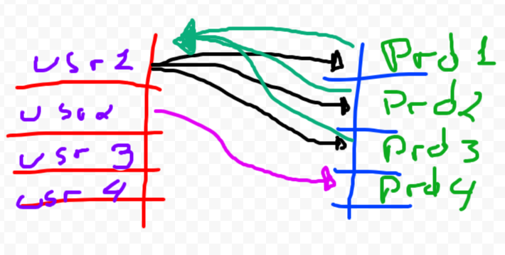
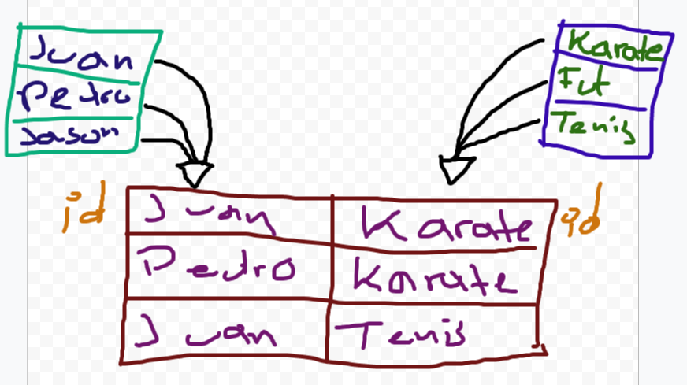

# Basics

- [¿Que es SQL?](#¿Que es SQL?)
- [Database](#Database)
- [Rational Database Management System (DBMS)](#Rational Database Management System (DBMS))
- [Query](#Query)
- [Tipos de software de gestión de base de datos](#Tipos de software de gestión de base de datos)
- [What  SQL can do?](#What  SQL can do?)
- [Entendiendo Tablas en  SQL](#Entendiendo Tablas en  SQL)
- [Asociación de registros](#Asociación de registros)
- [Nombre de las columnas](#Nombre de las columnas)
- [RDBMS Installation (Postgres)](#RDBMS Installation (Postgres))


## ¿Que es SQL?

SQL (Structured Query Language) es un lenguaje de programación específico para gestionar bases de datos relacionales. Se utiliza para crear, modificar y consultar bases de datos, y es compatible con la mayoría de los RDBMS.


## Database

A database is an organized collection of structured information, or data, typically stored electronically in a computer system. A database is usually controlled by a database management system (DBMS). Together, the data and the DBMS, along with the applications that are associated with them, are referred to as a database system, often shortened to just database.

Una base de datos es un sistema que permite almacenar, organizar y recuperar información de manera eficiente. Puede ser utilizada para almacenar una variedad de datos, como información de clientes, inventarios, transacciones financieras, entre otros.


## Rational Database Management System (DBMS)

**The software used to store, manage, query, and retrieve data stored in a relational database** is called a relational database management system (RDBMS). The RDBMS provides an interface between users and applications and the database, as well as administrative functions for managing data storage, access, and performance

Some RDBMS are :

- MySQL
- Postgres
- MariaDB
- Oracle
- Infornix


Some of their tasks:

- Acceder a la base de datos de manera fácil. 
- Seguridad e integriadad de los datos.
- Importar y exportar datos. 
- Respaldar los datos. 
- Gestionar la concurrencia. 
- Conectarse con distintos lenguajes de programación como (PHP, Python, JS).
- Operaciones comunes:
  - C: Create.
  - R: Read.
  - U: Update.
  - D: Delete.


Entonces un RDBMS (Sistema de gestión de base de datos relacional) es un tipo específico de sistema de gestión de base de datos que utiliza un esquema de tablas relacionales para almacenar y recuperar datos. En un RDBMS, los datos se organizan en tablas con filas y columnas, y se relacionan mediante claves foráneas. 


## Query

Un query es una solicitud o pregunta que se envía a una base de datos para recuperar o modificar datos. En SQL, un query se escribe utilizando comandos específicos del lenguaje.


La relación entre estos elementos es la siguiente:

- Una base de datos es el sistema de almacenamiento de datos en sí, mientras que un RDBMS es el software específico utilizado para gestionar esa base de datos.
- Un query es una solicitud que se envía a una base de datos para recuperar o modificar datos, y SQL es el lenguaje utilizado para escribir esas solicitudes o preguntas.

En resumen, una base de datos es el contenedor de los datos, un RDBMS es el software que permite interactuar con esa base de datos, las consultas o queries son las preguntas que se hacen a la base de datos, y SQL es el lenguaje para hacer esas preguntas.


## Tipos de software de gestión de base de datos

SQL and non-SQL


### SQL

Estos software de gestión almacenan la información en forma de tablas, las cuales tienen filas y columnas. Por lo que se guardaría la información de la siguiente manera:

| id   | nombre  | edad |
| ---- | ------- | ---- |
| 01   | Juan    | 21   |
| 02   | Pedro   | 20   |
| 03   | Ignacio | 32   |


### Non-SQL

Las que no son SQL tienen múltiples formas de almacenar los datos, como almacenarlos en un formato Json, Bson, Blob, key-value, etc. 


## What  SQL can do?

- SQL can execute queries against a database
- SQL can retrieve data from a database
- SQL can insert records in a database
- SQL can update records in a database
- SQL can delete records from a database
- SQL can create new databases
- SQL can create new tables in a database
- SQL can create stored procedures in a database
- SQL can create views in a database
- SQL can set permissions on tables, procedures, and views


## Entendiendo Tablas en  SQL


SQL almacena la información en forma de tablas. Como un excel la tabla tiene "**columnas**". Ahora cuando hablamos las filas, estas se les conocen como "**registros**". Por último cuando hablamos de la información que va en cada celda de la tabla se le conoce como "**dato**".


| id   | Columns (Vertical)   ↓                  |      |
| ---- | --------------------------------------- | ---- |
| 1    | Registers (Horizontal) →                |      |
| 2    | data (The information inside the table) |      |
| 3    |                                         |      |


El "ID" de todas las tablas sql se generarán de forma automática y será de manera autoincremental.


## Asociación de registros

Existen dos modelos de asociación de registros entre tablas.

- 1 - n
- n - n


### 1-n

Es cuando un registro de una tabla A puede crear muchos registros de una tabla B. Pero un registro de una tabla B solo pudo haber sido creado por un registro de una tabla A.

Por ejemplo si se tiene una tabla de usuarios y una de productos. Un usuario puede crear muchos registros de productos, pero un solo producto es creado por un solo usuario.




### n-n

Es cuando un registro de una tabla A puede estar relacionado con muchos registros de una tabla B y viceversa.

Si se tienen dos tablas, uno de alumnos y una de deportes. Si un alumno está inscrito a muchos deportes, se tiene que crear una tercera tabla "alumnos_deporte". Dentro de esta tabla se le agrega el id del alumno y el id del deporte.





## Nombre de las columnas


### User

| Id (Primary Key) | name | last name |
| ---------------- | ---- | --------- |
|                  |      |           |
|                  |      |           |
|                  |      |           |


**Primary Key**

Una primary key (clave primaria) es un campo o conjunto de campos en una tabla de base de datos que se utiliza para identificar de manera única cada registro en esa tabla. Es decir, cada valor en la columna de la clave primaria debe ser único y no puede ser nulo. Una tabla puede tener solo una clave primaria.

Es decir, será el ID de cada dato la tabla.


### Productos

| id  (Primary Key) | name | user_id (foreign key) |
| ----------------- | ---- | --------------------- |
|                   |      |                       |
|                   |      |                       |
|                   |      |                       |


**Foreign Key**

Un foreign key (clave foránea) es un campo o conjunto de campos en una tabla que se utiliza para establecer una relación con otra tabla. Es decir, la clave foránea se refiere a un valor en la clave primaria de otra tabla. Una tabla puede tener varias claves foráneas.

Es decir, será el ID de otra base de datos.


## RDBMS Installation (Postgres)


### Postgre

https://www.postgresql.org/download/

Una vez hecho los pasos de instalación en la página oficial para poder usar postgresql iremos a la consola. Postgre nos da un usuario al cual podemos acceder de la siguiente manera:

```bash
sudo -u postgres psql
```


"-u" se usa para seleccionar el usuario "postgres" es el usuario "psql" el comando que inicia postgres. 


| Command | Description    |
| ------- | -------------- |
| \l      | List databases |
| \q      | exit postgres  |


#### Interfaz gráfica 

pgadmin nos permite visualizar nuestras bases de datos y manejarlas de una manera más sencilla. Los pasos de instalación se encuentran en su página oficial:

https://www.pgadmin.org/download/


[Back to top](#Basics)
